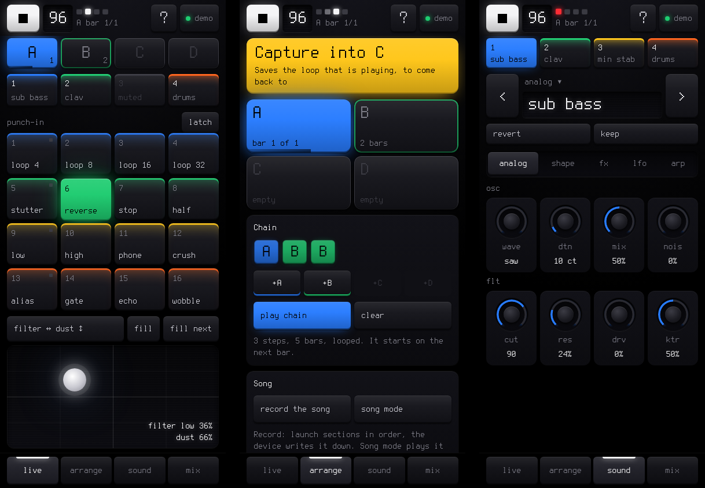
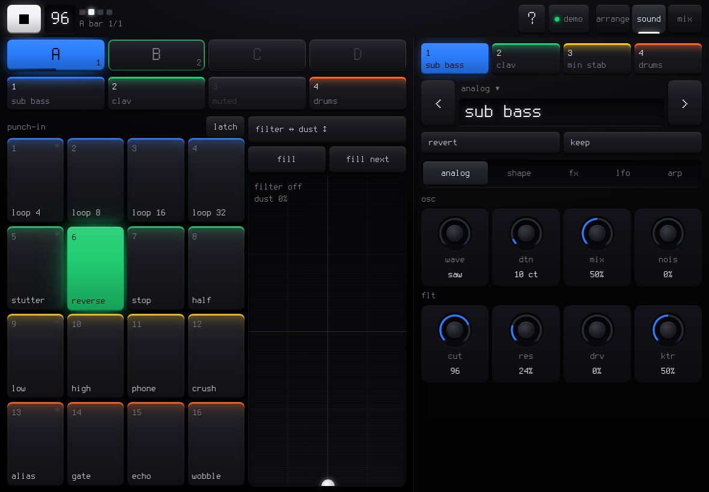

# SLOOP live

**The touch partner for SLOOP on the M-VAVE FM-1.** Poke out a beat on the FM-1, plug a phone or a tablet in, and play
it without menus: punch-in effects, the DJ filter on an XY pad, sections and chains, presets and the engine's knobs,
the mix. Your hands stay on the FM-1 for the notes; everything you would hold a button for is one touch away.

SLOOP live is a web page that installs as an app. It runs on the phone, talks to the FM-1 over the USB cable, and needs
no account, no server and no download beyond the page.

**Open it:** <https://isod89.github.io/sloop-fm1/webapp/live/> (*Try the demo* on that page works anywhere, with a
pretend FM-1).

## Contents

1. [What you need](#what-you-need)
2. [First time](#first-time)
3. [A jam, start to finish](#a-jam-start-to-finish)
4. [The top bar](#the-top-bar)
5. [Live](#live)
6. [Arrange](#arrange)
7. [Sound](#sound)
8. [Mix](#mix)
9. [Tablets](#tablets)
10. [Plugging and unplugging](#plugging-and-unplugging)
11. [Troubleshooting](#troubleshooting)
12. [What could come next](#what-could-come-next)

---

## What you need

| | |
| --- | --- |
| **The FM-1** | running SLOOP with editor protocol **v11** (the `PERFORM` command). With older SLOOP firmware the Sound and Mix tabs work; the pads, sections and transport stay greyed out and the page says so. |
| **A phone or tablet** | **Android with Chrome**. Chrome has Web MIDI, which the page needs to talk to the FM-1. A computer works too: **Chrome or Edge** on macOS, Windows or Linux. |
| **A cable** | a USB **data** cable from the FM-1 to the phone. Most phones need a USB-C OTG adapter (or a USB-C to USB-C data cable). Charge-only cables do not carry MIDI. |

**iPhone and iPad:** Safari has no Web MIDI, so the page cannot reach the FM-1 from them directly. It can talk to a
small relay next to the FM-1 instead (see [What could come next](#what-could-come-next)).

## First time

1. Open the page in Chrome and press **Connect the FM-1**.
2. Chrome asks whether the site may use MIDI devices (with *control and reprogram* for SysEx): **Allow**.
3. **Add it to the home screen** (Chrome menu, *Add to Home screen* or *Install app*). It then opens full screen,
   works offline, and keeps the screen awake while the FM-1 is connected. Online it always opens the latest version;
   when one arrives while it is open, a blue bar offers to **reload**.

From then on there is no button to press: open SLOOP live and plug the FM-1 in, in either order. It connects by itself.

## A jam, start to finish

1. **Make a loop on the FM-1** as you always do: a drum pattern, a bass line.
2. **Plug the phone in.** The status pill turns green (**usb**) and the tabs fill in.
3. **Arrange → Capture into A.** The loop is now section A. Change something on the FM-1 (a new hi-hat, a different
   bass), then **Capture into B**. A third idea into **C**.
4. **Live → tap B.** It starts on the next bar, in time. Tap A to go back.
5. **Arrange → Chain:** tap **+A +B +A +C**, then **play chain**. Each section plays its own length, round and round.
6. **Live:** hold **reverse** before the drop, drag the **XY pad** left for a low-pass sweep (it springs back when you let
   go), hold a track to **solo** it for a bar, tap to **mute** the drums for a breakdown, **fill** while held.
7. **Sound:** flip through presets on the bass with **‹ ›**, turn **cut** and **res**, add **delay** on the **fx** page.
   Like it? **keep** saves it as a user preset. Lost it? **revert** goes back to the preset.
8. **Arrange → record the song**, launch the sections in the order of the song, then **stop recording**. **Song mode**
   plays it back with PLAY.

## The top bar

| | |
| --- | --- |
| **Play / stop** | the transport, as PLAY on the FM-1 (count-in and REC arming work as on the device). |
| **Tempo** | the BPM. **Tap it** in time to set the tempo (tap tempo). |
| **Position** | four beat lights (the first red), the section playing and the bar (*A bar 2/4*), and the section coming next (*> B*). |
| **?** | help: how the tab on screen is played, this guide, and what could come next. |
| **Status** | **usb** (connected), **demo**, **waiting** (no FM-1 yet), **unplugged**, or **no reply**. Tap it for the versions, the demo, and **update and reload**. |

## Live

What the hands want while the loop plays.

**Sections A–D** (top row): the section playing is filled in its colour, with a bar along the bottom showing where it
is; the next one blinks; an empty one is dashed. The small number is its length in bars.

- **Tap**: play it on the next bar (stopped: it becomes the loop at once). Any chain stops.
- **Hold**: save the loop that is playing into it. Over a section that already holds a loop, hold it **twice** within
  3 seconds, as on the FM-1.

**Tracks 1–4** (second row): each shows its preset (or *drums*).

- **Tap**: mute / unmute.
- **Hold**: solo while held; the other tracks fade. Let go and the mix comes back.

**Punch-in pads**: the 16 punch-in effects, in the order of the FM-1's white keys (pads 1, 5, 9 and 13 carry the dim
mark the FM-1's keys glow with). Each row wears a track colour.

| Pad | Effect | Pad | Effect |
| --- | --- | --- | --- |
| 1 | loop 1/4 | 9 | low-pass sweep |
| 2 | loop 1/8 | 10 | high-pass sweep |
| 3 | loop 1/16 | 11 | phone |
| 4 | loop 1/32 | 12 | bit crush |
| 5 | stutter (1/16 triplets) | 13 | alias (sample-rate drop) |
| 6 | reverse | 14 | gate 1/16 |
| 7 | tape stop | 15 | echo (dotted 1/8) |
| 8 | half speed | 16 | tape wobble |

- **Hold** a pad: the effect runs on the whole mix; let go and it lets go. Loops and the gate start on the grid.
- **Two fingers**: the last pad pressed plays; lift it and the first one comes back.
- **latch**: a tap turns an effect on, another tap turns it off.
- A pad **framed** in its colour is an effect played from the FM-1's own keys (FX + key). The FM-1 always wins: a key
  pressed there takes over from the phone.

**XY pad**: put a finger down and move. By default **across** is the DJ filter (left: low-pass, centre: off, right:
high-pass) and **up** is DUST. When you let go it **springs back** to where it was.

- Tap the label above it (*filter ↔ dust ↕*) to choose what each axis moves: the master (filter, dust, duck) or the
  selected track (its filter, delay send, reverb send, drive, or any of its engine's eight knobs, such as cut or res).
  The same sheet turns **spring back** off, so a move stays where you leave it.
- **fill** (hold): the drum fill while held. **fill next**: the next bar is a fill (tap again to cancel).

## Arrange

From a loop to a song.

- **Capture into A** (the next empty section): saves the loop that is playing as that section. When all four hold a
  loop the button reads **Replace a section**: tap it, then tap the section to replace.
- **Sections**: tap to play on the next bar; **hold** for its menu: play it, replace it with the loop that is playing,
  add it to the chain.
- **Chain**: tap **+A +B +C +D** in the order to play them (up to 8, repeats allowed). Tap a block to take it out.
  **play chain** starts it on the next bar; each section plays its own length (its longest pattern), round and round.
  The section playing is shown in brackets: *[A] B B*. A single section tap ends the chain.
- **Song**: **record the song** arms SONG REC: from the next bar, every section you launch and how many bars it plays is
  written into the song. **stop recording** (or STOP) keeps it. **song mode** switches PLAY between the loop and the song.

## Sound

The selected track's sound, without menus. The selected track is the FM-1's: pick one here and the FM-1 follows; pick
one on the FM-1 and this page follows. Knob moves on the FM-1 show up here as they happen.

- **Track tabs 1–4**: select a track.
- **‹ preset ›**: the previous / next factory preset of the engine. **Tap the name** for the whole list, and **your
  sounds** (the user presets U01–U32, from any engine).
- **engine ▾** (above the name): pick another engine; it starts from its first preset (the pattern, the mix and the key
  stay).
- **revert**: back to the preset (undoes your knob moves). **keep**: save the sound as a user preset in the first free
  slot, with a name. Keeping writes the FM-1's flash: stop the song first if it asks.
- **Pages**, eight knobs each:

| Page | Knobs |
| --- | --- |
| *the engine's name* | the engine's own eight, titled as on the FM-1 (ANALOG: wave, dtn, mix, nois / cut, res, drv, ktr) |
| shape | attack, decay, sustain, release / the track filter, env > filter, env > pitch, glide |
| fx | drive, chorus, delay, reverb / slicer, pattern, slice rate, depth |
| lfo | rate, wave, fade in, phase / > pitch, > filter, > shape, > level |
| arp | mode, rate, octaves, gate / swing, chance, hold, order |

- **Knobs**: drag up or down anywhere on the tile (a touch does not jump the value). **Double tap**: back to the default.
  A knob with named values (a waveform, a mode) also opens its list on a tap.

**The drum track** shows the **kit** instead of a preset: **‹ ›** steps through the kits, a tap on the name lists them
all. Its knobs: level, reverb, delay, swing, pan, filter.

## Mix

- **The four levels**: drag a fader. **mute** and **solo** under each.
- **Master**: tempo, swing, dust, duck, the roll rate (ARP + key), the DJ filter. Double tap a fader: its default.

## Tablets

On a tablet (or any screen at least 1000 × 600, or 700 × 900 standing up) the screen splits: **Live stays on screen**,
and the tab bar chooses the other pane: Sound, Arrange or Mix. In landscape it sits beside Live, standing up below it.
Hold a pad with one hand and turn a knob or build a chain with the other.

## Plugging and unplugging

- **Plugged in**: SLOOP live connects within a second, reads the tracks and the master, and follows the FM-1 from then on.
- **Unplugged**: the page stays as it was, dimmed, and says so. Plug the FM-1 back in and it carries on by itself.
- **Safety**: an effect or a fill held from the phone lets go by itself if the phone goes quiet for 1.5 seconds (the
  cable pulled, the phone locked, the app in the background). The mix never stays stuck in a loop.
- **The web editor and SLOOP live at the same time**: both talk to the FM-1 through the same MIDI port. Use one at a time:
  close the editor's tab (or Disconnect it) before you play with SLOOP live.

## Troubleshooting

| What you see | What to do |
| --- | --- |
| *This browser has no Web MIDI* | Use Chrome on Android, or Chrome / Edge on a computer. Safari (iPhone, iPad) has none. |
| *MIDI access is blocked for this site* | Chrome: the lock icon in the address bar → *Site settings* → *MIDI devices* → *Allow*, then reload. |
| **waiting**, the FM-1 plugged in | A charge-only cable or adapter: try another (it must carry data). On a phone, unlock it and accept any USB prompt. |
| **no reply** | Another page (the web editor) has the FM-1: close it. Otherwise unplug the FM-1 and plug it back in. |
| *speaks protocol v10* (or older) | The FM-1 runs a SLOOP without `PERFORM`: install a SLOOP that has it. The Sound and Mix tabs work meanwhile. |
| A control is missing on the Sound page | The firmware names that parameter differently: SLOOP live hides a control rather than send a value to the wrong place. |
| The page looks old after an update | Online it always opens the latest version. An installed app that stays open shows a blue bar when a new version is ready: **reload**. Or tap the status, then **update and reload**. |

## What could come next

**?** in the top bar lists what could be added, each with the decision it needs first. In short:

- **The song order on the phone** (reorder, repeats) — needs the song order readable and writable over USB.
- **Clear a section**, **repeats in a chain** — small firmware additions.
- **Steps on the phone** (the drum grid) — the protocol has it; a screen of its own.
- **Mutate**, **record knob moves** as parameter locks, **shape the SYN drum kits**, **scenes and morph**.
- **No cable**: the page already talks to a WebSocket relay of raw MIDI (`?ws=ws://host:port`). A small relay on a
  computer or a Raspberry Pi next to the FM-1 would let any phone play it, iPhones too.

Developers: how it is built, tested and extended is in [web/live/README.md](web/live/README.md); the commands are in
[web/EDITOR_PROTOCOL.md](web/EDITOR_PROTOCOL.md) (v11: `PERFORM`).
