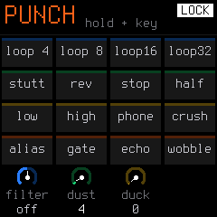

# 01. Hardware & Controls Guide

The M-VAVE FM-1 hardware features **14 buttons**, **7 rotary encoders (knobs)**, and a **240 × 240 pixel color display**.



---

## 1. The Knobs & Encoders

The FM-1 features **1 analog volume potentiometer**, **3 navigation encoders**, and **4 parameter knobs**:

* **`MASTER` (Top Left):** Master volume.
* **`SELECT` (Top Right):** Global Tempo (BPM). Turn on any screen to adjust tempo from 40 to 240 BPM without entering a menu.
* **`PRESETS` (Bottom Left):** Sound Browser. Turn to scroll synth presets (Tracks 1–3), drum kits (Track 4), or menu options.
* **`ALGORITHM` (Bottom Right):** 4-Track Selector. Turn left/right at any time on any screen to switch between Track 1 (Blue Bass), Track 2 (Green Keys), Track 3 (Yellow Lead), and Track 4 (Orange Drums).
* **`KNOB 1 – 4`:** Parameter Knobs. Directly control the 4 parameter columns or dials shown on the active screen. Turning a knob highlights its column in white (or shows a large readout if **ZOOM** is enabled in the Home menu).

---

## 2. The Buttons: TAP vs. HOLD

> [!TIP]
> **Switching from Felucca or baud girl firmware?**
> On original Felucca and baud girl firmwares, buttons function solely as menu page switches. In SLOOP, **holding** any function button activates a live **Performance Layer** (16 white keys become direct function tiles!). To use buttons like traditional sound design menus, simply **tap** them (press and release quickly).

Every function button has two distinct lives:

### TAP (Quick Press and Release)
Tapping a button opens its dedicated **editing pages**.
* If a button has multiple pages (e.g. `ENV` has 2 pages, `FX` has 4 pages), tapping the button repeatedly cycles through them in sequence (`1/2` $\rightarrow$ `2/2` $\rightarrow$ `1/2`).
* The footer of the screen displays the current page number and family title (e.g., `ENV DEST 2/2`).

### HOLD (Keep Pressed Down)
Holding a button activates its **Performance Layer**.
* While held, the 16 white keys transform into function tiles and the 4 bottom knobs control live performance macros.
* The screen displays a grid of 16 colored tiles reflecting what each key does.
* **Releasing the button** immediately returns you to playing normal notes.

### How to Lock a Layer Open (`LOCK`)
If you need both hands to tweak knobs and play keys inside a layer:
1. **Hold down the layer button** (e.g. `FX`, `SEQ`, `EDIT`).
2. **Tap `HOME`**.
3. Let go of both buttons!
4. The layer is now **locked open** (indicated by `LOCK` on screen and a blinking LED on the button).
5. **To exit:** Tap any other button (`HOME`, `ENV`, etc.) to return to normal mode.

---

## 3. Reading the Screen

SLOOP uses two distinct display layouts depending on whether you are editing sound parameters or in a live performance view:

### Layout A: Standard Edit Pages (Synthesis, Envelopes, LFO, FX, System)
Used across all standard parameter pages (`ENV`, `LFO`, `FX`, `GLO`, `ARP`, synth pages):

```text
┌──────────────────────────────────────────────┐
│ TRACK 1 [ANALOG]           BPM 90  4/4  REC  │ <- 1. Header (y: 0..20)
├──────────────────────────────────────────────┤
│  ATK         DEC         SUS         REL     │ <- 2. 4 Parameter Columns (y: 26..70)
│ 12 ms       140 ms       70 %       220 ms   │    (Driven by Knobs 1–4, with gauges)
├──────────────────────────────────────────────┤
│                                              │
│               [ VISUAL GRAPH ]               │ <- 3. Visual Graph Area (y: 74..198)
│         (ADSR Curve, Filter Slope, Wave)     │    (124 px graph + focus readout)
│                                              │
├──────────────────────────────────────────────┤
│ [||||||||||||||||] 16-step mini-lane         │ <- 4. Footer (y: 202..240)
│ T1 BASS     808 BOOM               ENV 1/2   │    (Engine/Preset, Step Lane, Page #)
└──────────────────────────────────────────────┘
```

1. **Top Header (y: 0–20):** Selected track badge (tape number & color), octave shift, BPM, battery, USB status, and recording state.
2. **4 Parameter Columns (y: 26–70):** Sits directly below the header. Four columns (Label, Value with units, and a progress gauge) corresponding 1:1 to **`KNOB 1`**, **`KNOB 2`**, **`KNOB 3`**, and **`KNOB 4`**. Turning a knob highlights its column in white.
3. **Visual Graph Area (y: 74–198):** The large central section (124 px tall). Dynamically plots animated ADSR envelopes, filter curves, wavetables, or FM algorithms.
4. **Bottom Footer (y: 202–240):** Shows the 16-step sequencer activity lane (current playback cursor and active triggers), engine icon, preset name, and page number (e.g. `ENV 1/2`).

---

### Layout B: Performance Screens & Layers (`HOME`, Drums, Song, Layers)
Used on performance-oriented views—the **`HOME`** 4-track mixer, the **Drum Machine** screen, the **Song Arranger**, and all **Button Hold Layers** (`punch`, `mix`, `steps`, `key`, `song`):

```text
┌──────────────────────────────────────────────┐
│ TRACKS  ► 1.1 [||||] 4/4              REC    │ <- 1. Header (y: 0..40)
├──────────────────────────────────────────────┤
│                                              │
│         [ PERFORMANCE TILES / LANES ]        │ <- 2. Visual Performance Area (y: 40..184)
│    (4 Track Faders, 16 Drum Pads, or Tiles)  │    (Mixer bars, 16 step lanes, pads)
│                                              │
├──────────────────────────────────────────────┤
│    ( )         ( )         ( )         ( )   │ <- 3. 4 Dial Knobs (y: 184..240)
│   swing       level       steps        pan   │    (Rendered as rotary dials at bottom)
│    50%         80%         16           0    │    (Driven by Knobs 1–4)
└──────────────────────────────────────────────┘
```

1. **Header (y: 0–40):** Shows current mode/layer title, playback state, and beat counter.
2. **Visual Performance Area (y: 40–184):** The center is dedicated to live interaction:
   * On **`HOME` (TRACKS):** Four horizontal lane strips showing volume faders, mute/solo badges, and live playback heads across all 4 tracks simultaneously.
   * On **Performance Layers:** A 4×4 grid of 16 colored tiles showing functions mapped to the 16 physical white keys.
   * On **Drum Screen:** 16-pad drum overview and pattern triggers.
   * On **Song Arranger:** Arrangement blocks, timeline bars, and section chains.
3. **4 Dials at the Bottom (`te_dials`, y: 184–240):** In these performance views, the 4 knob readouts are rendered as **rotary dials** with circular value arcs along the **bottom** of the display.

---

## 4. LED Indicators

* **Solid Lit LED:** Indicates the currently active screen or page family.
* **Flashing `PLAY` Button:** Pulses on every quarter note beat as a silent metronome.
* **Flashing `REC` Button:** Indicates recording is armed (`REC READY`) and waiting for your first note.
* **Solid `REC` Button:** Actively recording into the current track.
* **Blinking Layer Button:** Indicates a layer is currently **Locked Open**.
