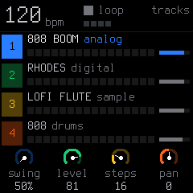
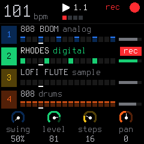
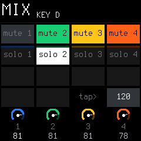
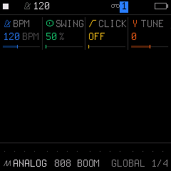
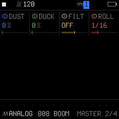
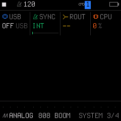
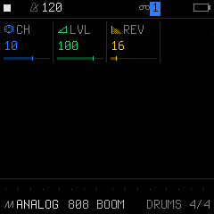

# 02. The 4 Tracks & Mixer Guide

SLOOP is designed around a dedicated 4-part architecture where every track has a specific musical role and color code.

---

## 1. Track Architecture & Voice Allocation

| Track | Color | Role | Engine | Voices | Default Patch |
| :---: | :---: | :--- | :--- | :---: | :--- |
| **1** | **Blue** | Bass | Analog / VA | Shared (up to 8) | *808 BOOM* |
| **2** | **Green** | Keys / Pad | Digital / FM | Shared (up to 8) | *RHODES* |
| **3** | **Yellow** | Lead / Melody | Sample / Synth | Shared (up to 8) | *LOFI FLUTE* |
| **4** | **Orange** | Drums | Drum Synth / PCM | 6 Voices | *808 Kit* |

* **Polyphony & Voice Budget:** Synth Tracks 1, 2, and 3 share a dynamic pool of **8 voices** with intelligent voice-stealing (bass and legato leads are prioritized and never cut off abruptly).
* **Track 4 (Drums):** Runs on its own dedicated 6-voice polyphonic engine, so drum hits never rob voices from your bass or chords.

---

## 2. The Main Performance Screen (`TRACKS`)

Tapping **`HOME`** brings you to the 4-track mixer view:

Each of the 4 horizontal rows displays:
1. **Track Badge:** Track number, color, and mute/solo/rec state.
2. **Preset Name:** Current sound or drum kit.
3. **Step Pattern:** Visual representation of the active steps (lit squares = hits).
4. **Playhead:** A moving marker indicating the current step playing.
5. **Level Meter:** Rightmost vertical bar showing the volume setting.

### Knob Controls on the `TRACKS` Screen
* **`KNOB 1 (SWING)`:** Sets swing timing for the selected track (50% straight to 75% heavy MPC swing).
* **`KNOB 2 (LEVEL)`:** Volume level of the selected track (0 to 127). Turning this on a muted track automatically unmutes it!
* **`KNOB 3 (STEPS)`:** Pattern length for this track (from 1 up to 64 steps).
* **`KNOB 4 (PAN)`:** Stereo placement (L64 ... Center ... R63).

---

## 3. The `mix` Performance Layer (Mute, Solo, Tap Tempo)

Hold the **`GLO`** button down to enter the live performance mixer:

### Key Grid (16 White Keys)
* **White Keys 1–4:** **MUTE** Tracks 1, 2, 3, or 4 (lit = active, dimmed = muted).
* **White Keys 5–8:** **SOLO** Tracks 1, 2, 3, or 4 (white badge = solo active).
* **White Key 15:** Shows the label `tap>`.
* **White Key 16:** **TAP TEMPO** — flashes on the quarter beat and displays current BPM. Tap rhythmically to calculate and set the song tempo on the fly!

### Knob Controls in the `mix` Layer
The 4 dials along the bottom of the screen correspond to the 4 tracks:
* **`KNOB 1` (`1`):** Direct volume level for Track 1 (0 to 100%).
* **`KNOB 2` (`2`):** Direct volume level for Track 2 (0 to 100%).
* **`KNOB 3` (`3`):** Direct volume level for Track 3 (0 to 100%).
* **`KNOB 4` (`4`):** Direct volume level for Track 4 (0 to 100%).
* **`SELECT` (Top Right):** Global BPM tempo (can be adjusted at any time).

*(Tip: Lock this screen open by holding `GLO` and tapping `HOME` so both hands are free to mix and mute).*

---

## 4. Master Bus & Global Pages (`GLO`)

Tapping **`GLO`** cycles through 4 system-wide sound shaping and setup pages:

### Page 1/4: `GLOBAL`

* **K1 (`BPM`):** Song tempo (40 to 240 BPM).
* **K2 (`SWING`):** Global swing added across all tracks.
* **K3 (`CLICK`):** Metronome click (`OFF`, `REC` only, or `ON` continuous).
* **K4 (`TUNE`):** Master tuning in cents ($\pm 50$ cents).

### Page 2/4: `MASTER`

Master bus effects that process the entire stereo mix:
* **K1 (`DUST`):** Vinyl emulation, saturation, and lo-fi grit.
* **K2 (`DUCK`):** Sidechain compressor — automatically pumps the synth tracks to the kick drum!
* **K3 (`FILT`):** DJ-style master filter:
  * Turn left: Low-Pass Filter (`LP 1%` to `LP 100%`).
  * Center: Filter bypassed (`OFF`).
  * Turn right: High-Pass Filter (`HP 1%` to `HP 100%`).
* **K4 (`ROLL`):** Sets default repeat rate for ARP note repeats (`1/8`, `1/16`, `1/32`, `32T`, `1/64`).

### Page 3/4: `SYSTEM`

* **K1 (`USB`):** USB MIDI connection state (`OFF`, `WAIT`, `ENUM`, `MIDI`, or `BUS`).
* **K2 (`SYNC`):** Master clock synchronization source:
  * `INT`: Internal SLOOP master clock.
  * `USB`: Synchronizes playback and BPM to incoming USB MIDI clock.
  * `TRS`: Synchronizes playback and BPM to incoming 3.5mm TRS hardware MIDI clock.
* **K3 (`ROUT`):** Hardware audio output routing indicator (`--`).
* **K4 (`CPU`):** Real-time DSP processor load percentage readout.

### Page 4/4: `DRUMS`

* **K1 (`CH`):** General MIDI drum input channel (default: `10`).
* **K2 (`LVL`):** Master drum bus gain level (0 to 127).
* **K3 (`REV`):** Master reverb send level for the entire drum bus.
* **K4:** Unused on this page.
