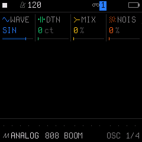
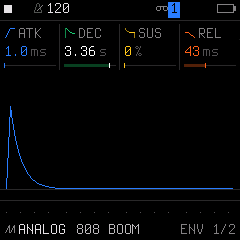
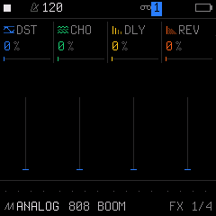
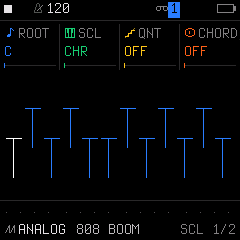
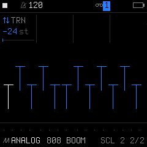
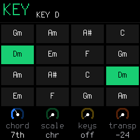

# 03. Sound Design & Synth Engines

SLOOP includes **9 distinct sound synthesis engines** on the FM-1, plus comprehensive envelopes, LFO modulation, per-track effects, and musical scale quantization.

## 1. The 9 Synthesis Engines

Every synth track (Tracks 1, 2, and 3) can load any of the 9 engines:

| Engine | Type | Character | Best For | Dedicated Guide |
| :--- | :--- | :--- | :--- | :--- |
| **`ANALOG`** | Virtual Analog | Warm, resonant, fat | Basslines, acid, warm pads | [ANALOG Guide](engines/01-analog.md) |
| **`DIGITAL`** | 4-Op FM | Metallic, punchy, crisp | Electric pianos, bells, clav | [DIGITAL Guide](engines/02-digital.md) |
| **`PHASE`** | Phase Distortion | Edgy 80s digital character | Punchy plucks, digital strings | [PHASE Guide](engines/03-phase.md) |
| **`LOFI`** | Chiptune Chip | Gritty 8-bit pulse & noise | Arcade leads, retro game FX | [LOFI Guide](engines/04-lofi.md) |
| **`SAMPLE`** | Multisample | Natural acoustic instruments | Acoustic grand, upright bass | [SAMPLE Guide](engines/05-sample.md) |
| **`VOICE`** | Formant Synthesis | Talkbox & vocal vowel sweeps | Vocal chops, talking leads | [VOICE Guide](engines/06-voice.md) |
| **`TRIO`** | 3-Oscillator | Detuned, aggressive, massive | Supersaws, hoovers, rave stabs | [TRIO Guide](engines/07-trio.md) |
| **`WHEEL`** | Tonewheel Organ | Classic drawbars with rotary | 90s house organs, jazz & gospel | [WHEEL Guide](engines/08-wheel.md) |
| **`GRAIN`** | Granular Cloud | Ethereal, evolving, dreamy | Ambient textures, soundscapes | [GRAIN Guide](engines/09-grain.md) |

*(Click any engine name above to view its dedicated parameter reference, screenshots, and sound design recipes).*

### How to Access the Engine Screens

To view and edit the synthesis parameters for the active engine:

1. **Select a Synth Track:** Turn **`ALGORITHM`** (Bottom Right knob) to select **Track 1, 2, or 3** (Track 4 is the dedicated drum machine).
2. **Tap `EDIT`:**
   * **1st Tap $\rightarrow$ `EDIT 1` (Engine Page 1):** Accesses the primary oscillator / generator parameters (Knobs 1–4).
   * **2nd Tap $\rightarrow$ `EDIT 2` (Engine Page 2):** Accesses the engine's filter, modulation, or tone parameters (Knobs 1–4).
   * **3rd Tap $\rightarrow$ `VOICE` (Voice Mode):** Polyphony mode (`POLY`, `MONO`, `LEGATO`, `UNISON`), glide time, glide mode, voice priority.
   * **4th Tap $\rightarrow$ `VOICE 2`:** Voice allocation algorithm, unison detune, pan, mute.
   * **5th Tap $\rightarrow$** Cycles back to `EDIT 1`.

*Note: The footer on the screen displays the specific page title for that engine (for example, `ANALOG: OSC 1/2` and `ANALOG: FLT 2/2` or `DIGITAL: OPS 1/2` and `DIGITAL: MOD 2/2`).*

---

### The Sound Designer's Workflow: From Concept to Saved Patch

> [!IMPORTANT]
> **Why does tapping `SAVE` from `HOME` open the Song Arranger?**
> On the main performance screen (`HOME`), tapping `SAVE` acts as a shortcut to the **`SONG`** arranger screen for groovebox production.
> 
> To open the sound library pages (**`PRESETS 1/4`**, **`USER 2/4`**, and **`TOOLS 4/4`**), **you must be on a sound editing page** (`EDIT`, `ENV`, `LFO`, or `FX`).

When building a sound from scratch or exploring engines, follow this comprehensive workflow:

#### Step 1: Choose Your Starting Point (Engine Jump or Clean Slate)

You have two ways to start:

* **Option A: Jump to a Synthesis Engine & Tweak an Existing Sound**
  1. From `HOME`, tap **`EDIT`** (or `ENV`).
  2. Now tap **`SAVE`**. Because you are in edit mode, the screen opens **`PRESETS 1/4`**.
  3. **Turn `KNOB 2 (ENG)`:** Instantly leaps between the 9 synthesis engines (`ANALOG`, `DIGITAL`, `PHASE`, `LOFI`, `SAMPLE`, `VOICE`, `TRIO`, `WHEEL`, `GRAIN`). The engine icon and name update immediately.
  4. Turn **`KNOB 1 (No.)`** or the physical **`PRESETS`** knob to audition factory sounds within that engine.

* **Option B: Start from a Clean Slate (`INIT SOUND`)**
  1. From `HOME`, tap **`EDIT`**, then tap **`SAVE` 4 times** until you reach **`TOOLS 4/4`**.
  2. Turn **`KNOB 2 (INIT)` twice within 1.5 seconds** (`AGAIN: INIT` appears on screen).
  3. The active engine resets to its neutral, default oscillator and filter parameters (`SOUND INIT` confirms).
  4. *(Note: Your recorded sequence pattern on this track is completely preserved).*

#### Step 2: Sculpt the Core Oscillators & Filters (`EDIT`)
1. Tap **`EDIT`** to jump straight into the engine's parameters:
   * **`EDIT 1` (Page 1/4):** Oscillator wave shapes, FM algorithm & ratios, drawbar registrations, or granular grain size and density.
   * **`EDIT 2` (Page 2/4):** Filter cutoff, resonance, saturation drive, or tone damping.
   * **`VOICE` (Page 3/4):** Polyphony mode (`POLY`, `MONO`, `LEGATO`, `UNISON`) and portamento glide time.
   * **`VOICE 2` (Page 4/4):** Voice stealing allocation (`ROT` vs `REUSE`), unison detune spread, and stereo pan.

#### Step 3: Shape Envelopes, Modulation & Effects
1. Tap **`ENV`**: Set attack time, decay, sustain, and release (`ENV 1/2`). On `ENV DEST 2/2`, dial in filter envelope sweeps (`FLT`) and pitch punch (`PIT`).
2. Tap **`LFO`**: Route vibrato (`PIT`), wah-wah (`FLT`), PWM wave animation (`SHP`), or tremolo (`AMP`).
3. Tap **`FX`**: Add harmonic overdrive (`DIST`), stereo chorus (`CHOR`), rhythmic slicing (`SLICER`), tempo delay (`DLY`), or stereo reverb (`REV`).

#### Step 4: Save to a User Slot on the Hardware (Page `USER 2/4`)
1. Once your sound is dialed in, tap **`SAVE`** until you reach page **`USER 2/4`**.
2. Turn **`KNOB 1 (SLOT)`** to pick user slot **1 to 32**.
3. Turn **`KNOB 4 (SAVE)`**: The screen displays **`AGAIN: SAVE`**.
4. Turn **`KNOB 4` a second time within 1.5 seconds** to confirm.
5. Your custom sound is permanently written into internal flash memory!
   * *To recall later:* On `USER 2/4`, turn `KNOB 2 (LOAD)` twice, or on `HOME`, turn the physical `PRESETS` knob past preset 68 to reach user slots `U01`..`U32`.

---

### Designing Presets with the Web Editor (Visual Sound Design)

If you prefer seeing all oscillator, envelope, and modulation parameters on a single screen:

1. Connect the FM-1 to your computer with a USB-C data cable and open the Web Editor (`http://localhost:8766/webapp/editor/` in Chrome or Edge).
2. Click **Connect** and select the **Sound** tab:
   * **Live Visual Controls:** Every single engine parameter, ADSR envelope curve, LFO routing, and FX send is displayed with simultaneous sliders and graphics.
   * **Two-Way Sync:** Twisting a knob on the FM-1 moves the editor slider in real time; adjusting a slider in your browser immediately updates the synthesizer on the FM-1.
   * **Export Patch File:** Click **`Save file`** to save the sound as a standalone `.json` patch file to your computer.
3. Switch to the **Library** tab:
   * **Unlimited Sound Library:** Store, organize, and search hundreds of custom patches by tags (`Bass`, `Lead`, `Pad`, `FX`).
   * **Audition:** Click **Audition** to send the sound to the FM-1 to play live without overwriting a slot.
   * **Transfer to Hardware:** Click **`To Slot`** to push any sound from your computer directly into one of the FM-1's 32 user memory slots (`U01`–`U32`).

---

## 2. Envelopes (`ENV`)

Tapping **`ENV`** accesses the ADSR volume and modulation envelopes:

### Page 1/2: `ENV` (Amplitude ADSR)
Controls the dynamic volume curve of notes as they are played and released:
* **K1 (`ATK`):** Attack time (0 ms up to several seconds).
* **K2 (`DEC`):** Decay time down to sustain level.
* **K3 (`SUS`):** Sustain volume level held while key is down (0% to 100%).
* **K4 (`REL`):** Release fade-out time after releasing the key.

### Page 2/2: `ENV DEST` (Modulation Routing)
Routes the envelope to modulate other parameters:
* **K1 (`FLT`):** Filter modulation amount (classic filter sweep on note attack).
* **K2 (`PIT`):** Pitch punch (indispensable for booming sub-bass thuds!).
* **K3 (`SHP`):** Wave shape / pulse-width envelope modulation.

---

## 3. LFO Generator (`LFO`)

Tapping **`LFO`** controls periodic low-frequency modulation:

### Page 1/2: `LFO` (Shape & Timing)
* **K1 (`RATE`):** LFO frequency (from slow 0.05 Hz sweeps up to fast 20 Hz, locked to tempo).
* **K2 (`WAVE`):** Waveform shape: `SINE`, `TRI` (triangle), `SAW`, `SQR` (square), or `S&H` (random sample & hold).
* **K3 (`PHASE`):** Starting phase of the cycle.
* **K4 (`FADE`):** Delay/fade-in time before the LFO starts modulating.

### Page 2/2: `LFO DEST` (Destinations)
* **K1 (`PIT`):** Pitch modulation (vibrato).
* **K2 (`FLT`):** Filter cutoff modulation (wah-wah).
* **K3 (`SHP`):** Waveform shape modulation (PWM / chorus-like movement).
* **K4 (`AMP`):** Volume modulation (tremolo).

---

## 4. Per-Track Effects & Master FX (`FX`)

Tapping **`FX`** cycles through 4 stereo effect pages:

### Page 1/4: `FX` (Track Sends)
* **K1 (`DIST`):** Harmonic overdrive / tape saturation for this track.
* **K2 (`CHOR`):** Send level to the master stereo chorus.
* **K3 (`DLY`):** Send level to the master tempo-synced delay.
* **K4 (`REV`):** Send level to the master stereo reverb.

### Page 2/4: `SLICER` (Rhythmic Chopper)
A dedicated rhythmic slicer applied to the track signal:
* **K1 (`SLCR`):** Slicer mode: `OFF`, `GATE` (rhythmic volume stutter), or `STUT` (audio buffer loop repeat).
* **K2 (`PAT`):** Pattern choice (16 rhythmic patterns).
* **K3 (`RATE`):** Division rate (1/8, 1/16, 1/32, triplets).
* **K4 (`DEPTH`):** Effect intensity (0% to 100%).

### Page 3/4: `DLY` (Global Stereo Delay)
* **K1 (`TIME`):** Delay sync timing (1/4, 1/8, 1/16, triplets).
* **K2 (`FDBK`):** Feedback repeats.
* **K3 (`COLR`):** High-cut damping filter on repeats.
* **K4 (`MIX`):** Delay return mix level.

### Page 4/4: `REV/CHO` (Global Reverb & Chorus)
* **K1 (`SIZE`):** Reverb space size.
* **K2 (`DAMP`):** Reverb high-frequency absorption.
* **K3 (`CRATE`):** Stereo chorus modulation speed.
* **K4 (`CDEPTH`):** Stereo chorus width and depth.

---

## 5. Musical Scales & Chords (`SEL` / `SCL`)

Never play a wrong note again! SLOOP locks the 16 white keys to any musical scale using the **`SEL`** button (screen pages labeled **`SCL`**):

### Page 1/2: `SCL` (Scale & Chords)
* **K1 (`ROOT`):** Root note (`C`, `C#`, `D`, `D#`, etc.).
* **K2 (`SCALE`):** Musical scale (`MAJOR`, `MINOR`, `DORIAN`, `PHRYGIAN`, `LYDIAN`, `MIXOLYDIAN`, `PENTATONIC`, `BLUES`, etc.).
* **K3 (`QUANT`):** Quantize live playing to scale (`OFF`, `SNAP`, or `WHITE`).
* **K4 (`CHORD`):** **One-Key Chord Mode!**
  * Turn to `OFF`, `TRIAD`, `7TH`, `9TH`, `SUS4`, or `POWER`.
  * Every white key now plays a full, lush chord in that scale with a single finger!

### Page 2/2: `SCL 2` (Track Transpose)

* **K1 (`TRN`):** Track Transposition in semitones (`-24` to `+24 st`). Transposes the pitch of this track up or down by up to 2 octaves without modifying the recorded step sequencer notes or changing the master song key.
* **K2 – K4:** Unused on this page.

---

### Quick Key Setup (The `key` Layer)
Hold **`SEL`** to view the key layer:

* **Tap any white key:** Instantly re-roots the whole song to that musical key!
* **Knobs:** Adjust `CHORD`, `SCALE`, `KEYS`, and `TRANSPOSE` in real-time.
