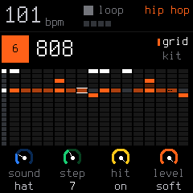
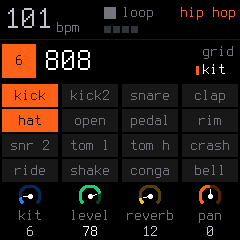

# 04. Drum Machine & Kits Guide

Track 4 is SLOOP's dedicated **16-sound polyphonic drum machine**, powered by 37 genre-defining drum kits (both synthesized and sampled).



---

## 1. Why Track 4 is Special (The Drum Architecture)

Track 4 is not just another track running a synth patch—**it is a completely independent, parallel drum machine subsystem**:

1. **Dedicated 6-Voice Polyphony (`NDRUM 6`):**
   * Synth Tracks 1, 2, and 3 share a dynamic pool of 8 voices.
   * **Track 4 has its own dedicated 6 voices running outside the synth voice budget.** 
   * This means you can play huge, dense 8-note chord pads on Track 2 while laying down lightning-fast drum rolls on Track 4, and **not a single synth voice or drum hit will ever be stolen or cut off!**

2. **Dual-Engine Architecture Under the Hood:**
   * **Kits 1–5 (Sample Engine):** Genuine acoustic studio recordings (CC0 recordings from Versilian Studios and Sonic Pi) stored as compressed IMA ADPCM samples in flash ROM with multiple vintage room treatments (`ACOUSTIC`, `DEEP`, `TIGHT`, `BRIGHT`, `DUST`).
   * **Kits 6–37 (Analog Drum Synth Modeling Engine):** Built from scratch like classic analog drum machines. Every single drum sound is calculated by a multi-component mathematical physical model:
     * **Tone Body:** Exponential pitch drop ($BEND$ semitones over time) with an amplitude $HOLD$ envelope before decay.
     * **Second Partial:** A second harmonic sine wave simulating the physical resonance of a drum head.
     * **Stick Click:** A 1–2 ms burst of high-frequency attack noise (the beater or stick hitting the drum skin).
     * **Noise Generator:** White noise, chip LFSR, or 808-style metallic clusters (6 detuned square waves for authentic cowbells and cymbals).
     * **Resonant State-Variable Filter (SVF):** Low-pass, band-pass, or high-pass that dynamically tracks velocity (softer hits are darker, harder hits are bright and punchy).
     * **Overdrive & Bit-Crush:** Built-in saturation drive and sample-rate reduction.

3. **16-Lane Multi-Pad Matrix Sequencer (`dstep_t`):**
   * Unlike the synth tracks (which hold up to 4 melodic notes per step), **every single step on Track 4 can trigger any combination of all 16 drum sounds simultaneously** (e.g. Kick + Snare + Closed Hat + Shaker on the exact same 16th note).
   * Each individual sound lane inside that step has its own independent velocity dynamics (`NORM`, `GHOST`, `SOFT`, `HARD`) and ratchet multiplier ($\times 1, \times 2, \times 3, \times 4$).

4. **The Master DUCK Trigger:**
   * Hitting Kick (`F3`) or Kick 2 (`G3`) automatically triggers the master **`DUCK`** envelope, sidechain-pumping the synth tracks down and back over an 1/8th note in perfect time without any complicated routing menus.

---

## 2. The 16 Drum Sounds (Keyboard Layout)

On Track 4, the **16 white keys** (from lowest `F3` to highest `G5`) each trigger a distinct drum sound:

| Key | Sound | Description | Key | Sound | Description |
| :---: | :--- | :--- | :---: | :--- | :--- |
| **`F3`** | **Kick** | Main low-end bass drum | **`G4`** | **Snare 2** | Secondary snare / layer |
| **`G3`** | **Kick 2** | Acoustic or punchy kick | **`A4`** | **Low Tom** | Floor tom |
| **`A3`** | **Snare** | Primary backbeat snare | **`B4`** | **Hi Tom** | High rack tom |
| **`B3`** | **Clap** | Handclap | **`C5`** | **Crash** | Crash cymbal |
| **`C4`** | **Hat** | Closed hi-hat *(chokes open)*| **`D5`** | **Ride** | Ride cymbal |
| **`D4`** | **Open Hat**| Sustained open hi-hat | **`E5`** | **Shaker** | Percussion shaker |
| **`E4`** | **Pedal Hat**| Foot-pedal hi-hat *(chokes open)*| **`F5`** | **Conga** | Hand percussion conga |
| **`F4`** | **Rim** | Rimshot / cross-stick | **`G5`** | **Cowbell** | Percussive cowbell |

* **Hi-Hat Choke:** Hitting the Closed Hat (`C4`) or Pedal Hat (`E4`) immediately cuts off the ringing Open Hat (`D4`), recreating an authentic drum kit performance.
* **Two-Finger Rolls:** Every black key triggers the sound of the white key to its left. You can drum with two fingers on one sound (e.g. index on `F3`, middle finger on `F#3`) to play lightning-fast snare and hat rolls!

---

## 3. The 37 Drum Kits

> [!NOTE]
> **Presets vs. Kits (Why the `PRESETS` knob changes meaning):**
> * **On Synth Tracks (1, 2, 3):** The physical **`PRESETS`** knob scrolls through **individual melodic patches** (e.g. *808 BOOM*, *RHODES*, *SUPERSAW*). Pressing different keys changes the pitch of that single sound.
> * **On Drum Track (4):** There are no "single drum presets". Instead, the **`PRESETS`** knob selects an entire **Drum Kit** (e.g. *808*, *909*, *TRAP*, *BOOMBAP*). Loading a kit instantly maps **all 16 distinct percussion sounds at once** across the 16 white keys!

> [!IMPORTANT]
> **Can I edit the drum kits or upload custom samples to Track 4?**
> * **Track 4 kits are fixed factory instruments:** You cannot modify the underlying synthesis parameters of the 32 modeled kits, and you cannot overwrite the samples for Kits 1–5.
> * **Want to play your own custom drum samples or vinyl break chops?**
>   * Use **Synth Tracks 1, 2, or 3** instead!
>   * Upload up to 16 custom drum WAVs (or slice a drum break with the `CHOP` tool) into user slots **`USR1`**, **`USR2`**, or **`USR3`** via the Web Editor.
>   * Select Track 1, 2, or 3, set the engine to **`SAMPLE`**, and set `KNOB 1 (SET)` to `USR1`.
>   * The 16 white keys now play your custom drum samples, complete with custom pitch tuning, 8-bit grit, saturation drive, and ADSR envelopes! You can even layer your custom sample kit on Track 3 over Track 4's foundation beat!

Turn the **`PRESETS`** knob on Track 4 (or KNOB 1 on the `DRUM KIT` page) to browse all 37 level-matched kits. Kits 1–5 are studio acoustic multisamples, while kits 6–37 are synthesised drum voices with dedicated per-instrument parameters:

| # | Kit | Style / Character | # | Kit | Style / Character |
| :---: | :--- | :--- | :---: | :--- | :--- |
| **1** | `ACOUSTIC` | Studio acoustic recordings | **20** | `ELECTRO` | Classic electro |
| **2** | `DEEP` | Soft acoustic | **21** | `DISCO` | 70s disco funk |
| **3** | `TIGHT` | Punchy acoustic | **22** | `GARAGE` | 2-step / UK garage |
| **4** | `BRIGHT` | Crisp acoustic | **23** | `JUNGLE` | Drum & bass / jungle |
| **5** | `DUST` | Vintage dusty acoustic | **24** | `DUBSTEP` | Heavy bass music |
| **6** | `808` | Classic hip hop sub & snap | **25** | `DEMBOW` | Reggaeton / Latin club |
| **7** | `909` | Classic house & techno punch | **26** | `AMAPIANO` | Amapiano log drum bass |
| **8** | `606` | Acid analog drums | **27** | `AFRO` | Afrobeat & percussion |
| **9** | `80S` | 80s gated pop drums | **28** | `LATIN` | Latin percussion groove |
| **10** | `VINTAGE` | Retro rhythm box | **29** | `TRIBAL` | Deep tribal percussion |
| **11** | `TRAP` | Trap drums with long 808 | **30** | `SYNTHWV` | Synthwave & retrowave |
| **12** | `DRILL` | Modern UK / NY drill | **31** | `CHIP` | 8-bit chiptune |
| **13** | `BOOMBAP` | Golden-era boom bap | **32** | `ARCADE` | Retro arcade game FX |
| **14** | `LO-FI` | Muffled, warm lo-fi hip hop | **33** | `GLITCH` | Digital IDM glitch |
| **15** | `PHONK` | Drift phonk melodic cowbell | **34** | `INDUSTR` | Heavy industrial distorted |
| **16** | `HOUSE` | Classic 4/4 house | **35** | `HYPER` | Hyperpop & futuristic |
| **17** | `D.HOUSE` | Deep house chords & kicks | **36** | `AMBIENT` | Soft ambient percussion |
| **18** | `TECHNO` | Dark warehouse techno rumble | **37** | `JAZZ` | Acoustic jazz brushes |
| **19** | `MINIMAL` | Minimalist clicks & thuds | | | |

---

## 4. Dedicated Drum Screens (`EDIT` & `SEQ`)

Tapping **`EDIT`** or **`SEQ`** while on the Drum track (from `HOME`) opens your drum views and toggles back and forth between two specialized modes:

### 1. The `DRUM GRID` (16 Sounds × 16 Steps Matrix)

A complete visual grid of all 16 sounds across all 16 steps of the current pattern:
* **K1 (`SOUND`):** Selects which drum sound row to inspect (Kick, Snare, Hat...).
* **K2 (`STEP`):** Moves the cursor left/right across steps 1 to 16.
* **K3 (`HIT`):** Turn to place or remove a drum hit on that step.
* **K4 (`LEVEL`):** Adjusts the velocity of that hit (`GHOST`, `SOFT`, `NORM`, `HARD`).

### 2. The `DRUM KIT` (Visual Pads)

Displays 16 virtual MPC-style pads that flash brightly whenever a drum sound triggers:
* **K1 (`KIT`):** Switch drum kits.
* **K2 (`LEVEL`):** Master drum volume level.
* **K3 (`REVERB`):** Drum bus reverb send.
* **K4 (`PAN`):** Drum stereo width and pan.

---

### Understanding the "DRUM TRACK" Guard Screen & Drum Effects

If you are on Track 4 and tap **`ENV`**, **`LFO`**, **`SEL`** *(Scale)*, or **`FX`**, you will see a screen with blank parameter columns and a large center label:

```text
       DRUM TRACK
SEQ  TRACKS  GLO DRUMS
```

> [!NOTE]
> **Why do I see "DRUM TRACK"? (Not a bug!)**
> * Track 4 is a dedicated drum machine—it does not have synth ADSR envelopes (`ENV`), synth vibrato LFOs (`LFO`), or musical key scales (`SEL`/`SCL`).
> * SLOOP shows this guard screen with the hint **`SEQ  TRACKS  GLO DRUMS`** to remind you that synth pages do not apply to the drum machine.
> 
> **Why does tapping `FX` show "DRUM TRACK"?**
> * The first FX page (`FX 1/4`) controls per-track synth sends (`DIST`, `CHOR`, `DLY`, `REV`). The drum engine has its own dedicated audio summing bus and does not use these individual send knobs.
> * **Where drum effects actually live:**
>   * **Drum Reverb Send:** Tap `EDIT` on Track 4 $\rightarrow$ toggle to the **`DRUM KIT`** page $\rightarrow$ **`KNOB 3 (REVERB)`** (or `GLO 4/4 > DRUMS`).
>   * **Drum Overdrive:** Built directly into each modeled drum sound and calibrated per kit.
>   * **Drum Slicer:** **Tap `FX` a second time!** Page **`SLICER 2/4`** is fully active on Track 4, allowing rhythmic gating (`GATE`) and buffer stuttering (`STUT`) on your drum grooves!
>   * **Master Delay & Reverb Size:** Tap `FX` a 3rd and 4th time for **`DLY 3/4`** and **`REV/CHO 4/4`** (global master effects).
>   * **Punch-In Drops & Tape Stops:** **Hold `FX`** and press any white key 1–16 to trigger live performance drops across the entire mix (drums + synths).
> 
> **Why `EDIT` behaves differently:**
> * If you tap `EDIT` **directly from `HOME` (Tracks)**, SLOOP knows you want the drum machine and immediately opens the **`DRUM GRID`**.
> * If you were already on a synth menu page (like `ENV`) and tap `EDIT`, SLOOP attempts to open synth oscillator page `EDIT 1`—which triggers the `DRUM TRACK` guard screen!
> * **How to get back immediately:** Simply tap **`SEQ`** (the drum sequencer) or tap **`HOME`** $\rightarrow$ then tap **`EDIT`**!

---

## 5. Drum Dynamics & Ratchets

### 4 Levels of Velocity
Every drum hit stores one of four velocity levels:
* `GHOST`: Very quiet background hit (essential for funky snare ghost notes).
* `SOFT`: Medium-low velocity.
* `NORM`: Standard velocity.
* `HARD`: Full accent strike.

**How to play them live:**
* Hold **`OCT−`** while tapping a drum key $\rightarrow$ records as a **Ghost** note.
* Hold **`OCT+`** while tapping a drum key $\rightarrow$ records as a **Hard** hit.

### Ratchets (Subdivisions)
A single step can trigger up to 4 rapid hits:
* Inside the `SEQ` step layer, **hold down any step key** and turn **KNOB 3 (`RATCHET`)** to set `x1`, `x2`, `x3`, or `x4` hits within that single 16th note!
