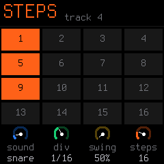
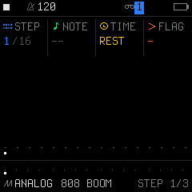

# 05. Step Sequencer Guide

SLOOP features two complementary ways to program sequences: a **fast, hands-on Elektron-style Step Layer** (with parameter locking) and a **deep numeric Step Editor** for surgical adjustments, ties, and 303-style slides.

---

## 1. The Step Layer (Elektron-Style Programming)

This is the fastest and most expressive way to program beats and melodies without playing in real-time.

### Entering the Step Layer
1. Select the track you want to edit using **`ALGORITHM`**.
2. **Hold `SEQ` and tap `HOME`**.
   * The layer is now **Locked Open** (`LOCK` appears on screen, `SEQ` button blinks).
   * The **16 white keys** represent the **16 steps** of the current page!
   * **Lit key:** Step contains a note or drum hit.
   * **Unlit key:** Step is a silent rest.

### Placing and Deleting Steps
* **Tap an empty key:** Instantly places a step with the last note/chord you auditioned (on synths) or the currently selected drum sound (on drums).
* **Tap a lit key:** Clears/deletes that step.

### Parameter Locking (Per-Step Editing)
To fine-tune a step without affecting the rest of the pattern:
* **Hold down that step key** and turn the knobs:
  * **KNOB 1:** 
    * *Synth Tracks:* Pitch of the note (e.g. `C2`, `D#2`, `G2`).
    * *Drum Track:* Drum sound (Kick, Snare, Hat, Rim...).
  * **KNOB 2 (`LEVEL`):** Dynamics (`GHOST`, `SOFT`, `NORM`, `HARD`).
  * **KNOB 3 (`RATCHET`):** Subdivisions ($\times 1, \times 2, \times 3, \times 4$ hits inside this step).
* Release the step key to lock in your changes!
* *(Tip: You can hold down multiple step keys at the same time to edit them together).*

### Navigating Patterns Longer than 16 Steps
If your track is 32, 48, or 64 steps long:
* While holding `SEQ`, press the first **4 black keys** or use **`OCT−` / `OCT+`** to switch between:
  * Page 1: Steps 1–16
  * Page 2: Steps 17–32
  * Page 3: Steps 33–48
  * Page 4: Steps 49–64

---

## 2. The Deep Numeric Editor (`STEP 1/3`)

Tap the **`SEQ`** button until you reach page **`STEP 1/3`**:

This screen gives you full control over every parameter of a single step:

* **KNOB 1 (`STEP`):** Moves the cursor step-by-step from `1` to `64`.
* **KNOB 2 (`NOTE`):** The musical pitch (or `--` for a rest).
* **KNOB 3 (`TIME`):** The step trigger behavior:
  * `NOTE`: Triggers a new note attack.
  * `TIE`: **Extends/sustains the previous note!** (Use this to create long, ringing basslines or sustained pad chords across multiple steps).
  * `REST`: Silent step.
* **KNOB 4 (`FLAG`):**
  * `-`: Normal step.
  * `ACC`: **Accent** (punchier velocity and louder level).
  * `SLD`: **Slide** (classic TB-303 portamento glides smoothly into the next note!).
  * `A+S`: Both Accent and Slide enabled simultaneously.

---

## 3. Pattern Settings (`PATTERN 2/3`)

Tap **`SEQ`** again to reach page **`PATTERN 2/3`**:

Controls the timing and rhythmic behavior of the selected track:

* **KNOB 1 (`LEN`):** Pattern length for this track (from `1` up to `64` steps).
* **KNOB 2 (`DIV`):** Clock division:
  * `1/16`: Standard 16th-note grid.
  * `1/8`: Half-time 8th-note grid.
  * `1/32`: Fast 32nd-note grid.
  * `8T`, `16T`, `32T`: Triplet grids.
* **KNOB 3 (`SWING`):** MPC groove swing (50% straight up to 75% heavy swing).
* **KNOB 4 (`GATE`):** Gate duration (short staccato plucks vs. full legato length).

---

## 4. The Song Chain Editor (`SONG 3/3`)

Tap **`SEQ`** a third time to reach page **`SONG 3/3`**:

> [!NOTE]
> **Why did the `SAVE` button light up?**
> When you tap `SEQ` for the third time, the FM-1 opens the **`SONG` arrangement chain editor**, and **the physical `SAVE` button LED turns ON** while `SEQ` turns off. 
> This is normal! In SLOOP, the Song Screen is tied directly to `SAVE`. You have not overwritten or deleted anything. For complete details on building song chains, see [07. Song Mode & Arranger Guide](07-song-mode.md).

---

## 5. Polymeters & Polyrhythms

Because **every track has independent `LEN` and `DIV` settings**, you can easily create complex, evolving polyrhythms:
* Set Track 4 (Drums) to a standard 16-step length (`LEN 16`, `DIV 1/16`).
* Set Track 1 (Bass) to a 14-step length (`LEN 14`).
* Set Track 3 (Lead) to a 5-step length (`LEN 5`).
* Because the pattern lengths do not divide evenly, the parts will continuously shift against each other, creating evolving, non-repeating musical patterns!
