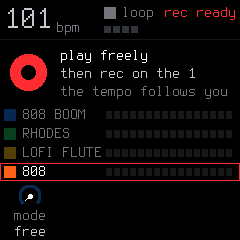
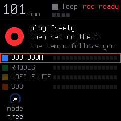
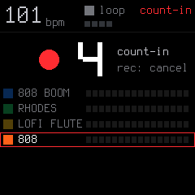
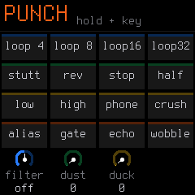
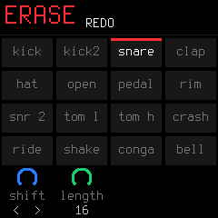
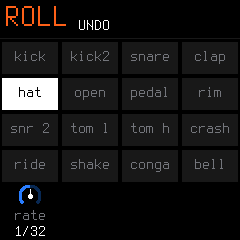
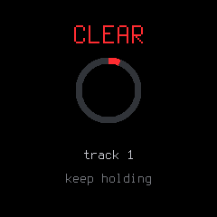

# 06. Live Recording & Performance Guide

SLOOP is built for spontaneous, live music-making. It features **latency-compensated live overdubbing**, **Free Takes** (where the machine calculates your tempo from how you play), and **live performance layers** inspired by teenage engineering pocket operators.

---

## 1. The Three Ways `REC` Works

Depending on whether playback is stopped or running, the **`REC`** button behaves dynamically:

| When | REC Action | Result |
| :--- | :--- | :--- |
| **Stopped, Empty Project** | Tap `REC` | **Free Take Mode:** The loop length and tempo follow you! |
| **Stopped, Project with Notes**| Tap `REC` | **Arm Mode (`REC READY`):** First note triggers the loop. |
| **Playing** | Tap `REC` | **Instant Overdub:** Immediately records onto the active track. |

---

## 2. Free Take Mode (The Magic Loop Creator)

When starting a new idea on an empty project, you don't need to set a BPM or listen to a click track:

1. Tap **`REC`**. The screen shows **`FREE TAKE`** and a timer in seconds.
2. **Play freely at your own natural groove and tempo.**
3. **Press `REC` on the "1" right after your last bar.**
4. SLOOP instantly:
   * Measures the exact time of your phrase.
   * Calculates the nearest musical tempo (BPM).
   * Snaps the phrase into 1, 2, or 4 clean bars.
   * Begins looping your beat immediately! All 4 tracks now share this length.
5. *(Press `PLAY` during a free take if you make a mistake to cancel and drop it).*

---

## 3. Arming with a Count-In (`REC READY`)

When you already have a tempo established, tapping **`REC`** while stopped arms the recording:

Before hitting your first note, you can use the knobs to configure the take:
* **KNOB 1 (`MODE`):** `FREE` (free take) or `TEMPO` (record at set BPM).
* **KNOB 2 (`LENGTH`):** Set track loop length (`1`, `2`, or `4` bars).
* **KNOB 3 (`START`):**
  * `NOTE`: Your very first keypress starts playback and becomes Step 1.
  * `COUNT`: Press **`PLAY`** to hear a 1-bar metronome count-in (`4`, `3`, `2`, `1` on screen) before recording starts!

---

## 4. Live Performance Layers

While your song is playing, you can dramatically remix and perform your music live using SLOOP's hold layers:

### 1. `FX` — Punch-In Effects
Hold down **`FX`**:

* **White Keys 1–16:** Trigger **16 instant punch-in effects** while the key is held:

| Key | Effect | Description | Key | Effect | Description |
| :---: | :--- | :--- | :---: | :--- | :--- |
| **1** | `Loop 1/4` | 1/4-bar loop repeat | **9** | `Low-Pass` | Sweeping low-pass filter drop |
| **2** | `Loop 1/8` | 1/8-bar loop repeat | **10** | `High-Pass` | Sweeping high-pass filter riser |
| **3** | `Loop 1/16` | 1/16-note loop roll | **11** | `Phone` | Narrow telephone band-pass |
| **4** | `Loop 1/32` | 1/32-note high-speed repeat | **12** | `Bit Crush` | Harsh 8-bit digital reduction |
| **5** | `Stutter` | 1/16 triplet rhythm stutter | **13** | `Alias` | Extreme sample rate drop |
| **6** | `Reverse` | Reverse audio playback buffer | **14** | `Gate` | 1/16 rhythmic volume gate |
| **7** | `Tape Stop` | Vintage vinyl / tape brake slowdown | **15** | `Echo` | Dotted 1/8 tempo delay throw |
| **8** | `Half Speed`| Half-speed octave pitch drop | **16** | `Tape Wobble`| Wow, flutter, and pitch chorus |

* **`KNOB 1 (FILTER)`:** DJ low-pass / high-pass sweep.
* **`KNOB 2 (DUST)`:** Vinyl grit, bit reduction, and noise.
* **`KNOB 3 (DUCK)`:** Heavy sidechain compression pumping.

### 2. `EDIT` — Erase as it Plays
Hold down **`EDIT`**:

* **Erase live (MPC style):** Hold `EDIT` and press any key (e.g. the hi-hat key `C4`). Every hat that passes the playhead while you hold the key is cleanly erased from the pattern!
* **Erase while stopped:** Deletes that note/drum sound from the entire pattern at once.
* **`KNOB 1 (SHIFT)`:** Nudges the entire pattern one step earlier or later (rotates the groove).
* **`KNOB 2 (LENGTH)`:** Right doubles pattern length ($\times 2$), left cuts it in half ($\frac{1}{2}$).
* **`OCT−` / `OCT+`:** Undo and Redo your edits!

### 3. `ARP` — Note Repeat & Rolls
Hold down **`ARP`**:

* **Hold any note or drum key:** The sound automatically repeats on the grid locked to tempo and swing!
* **`KNOB 1 (RATE)`:** Adjust the repeat speed (1/8, 1/16, 1/32, 32T, 1/64).
* *When recording is active, rolls are automatically printed into the sequence as ratchets!*

---

## 5. Clearing a Track Pattern

If you want to start a pattern over:
1. Turn **`ALGORITHM`** to select the track.
2. **Hold down `REC`** for about 2 seconds.
3. A progress ring fills up on screen:

4. Hold until the ring fills completely $\rightarrow$ the track's sequence is cleared! *(Letting go before it fills cancels the action safely).*
