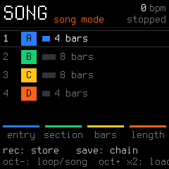
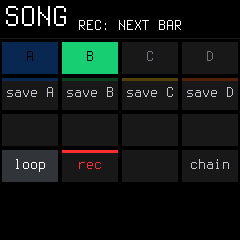

# 07. Song Mode & Arranger Guide

SLOOP features a live **4-part arranger** that lets you structure complete, multi-part songs up to 16 steps long using sections **A**, **B**, **C**, and **D**.

---

## 1. What is a Section (A, B, C, D)?

A common beginner trap is thinking that **A, B, C, and D** are tracks. They are not! 

* **The 4 Tracks (1: Bass, 2: Keys, 3: Lead, 4: Drums) are always playing simultaneously.**
* **Sections A, B, C, and D are complete, 4-track scenes (snapshots) of your entire groovebox:**
  * **Section A:** Your **Verse** (Full drum beat, subtle sub-bass, Rhodes chord progression, lead silent).
  * **Section B:** Your **Chorus** (Harder drums with ride cymbal, aggressive dirty bassline, loud lead melody).
  * **Section C:** Your **Bridge / Drop** (Drums muted, lush ambient pads, filter closed).
  * **Section D:** Your **Outro** (Stripped back drums and fade out).

Under the hood, Sections **A**, **B**, **C**, and **D** correspond directly to **Project Slots 1, 2, 3, and 4**.

---

## 2. Saving Your Loops into Sections: The Golden Rule

> [!CAUTION]
> **The Golden Rule: Always Store Before You Switch!**
> If you make changes to your drums or bassline while playing and then switch to another section without saving, **your unsaved tweaks will be lost!**
> 
> SLOOP loads the cued section into the active working buffer. To keep your edits, **always hold `SAVE` and tap the store key (`save A`, `save B`, etc.) before switching away!**

### Step-by-Step: Building Your Parts

1. **Build Your Verse:** Select preset sounds and record a drum groove, bassline, and chord progression.
2. **Lock it into Section A:**
   * **Hold down `SAVE`**. The screen shows the song layer with colored function tiles:
   

   * Press **White Key 5** (`C4` / labeled **`save A`**).
   * Your verse is now safely locked into Section A!
3. **Build Your Chorus:**
   * Keep playback running. Change the bassline, add hi-hat rolls, or unmute a lead sound on Track 3.
   * **Hold down `SAVE`** and press **White Key 6** (`D4` / labeled **`save B`**).
   * Your chorus is now safely locked into Section B!
4. **Build Breakdown & Outro:**
   * Repeat the process: store your breakdown into **Section C** (Key 7 / `save C`) and outro into **Section D** (Key 8 / `save D`).
5. *(Safety Feature: If a section already has data saved, the screen will ask you to press the key a second time within 3 seconds to confirm overwriting it).*

---

## 3. Performing Sections Live

You can jam with your 4 sections in real-time without stopping playback:

1. Press **`PLAY`**.
2. **Hold `SAVE` and press White Keys 1–4:**
   * **Key 1 (`A`):** Cues up Section A.
   * **Key 2 (`B`):** Cues up Section B.
   * **Key 3 (`C`):** Cues up Section C.
   * **Key 4 (`D`):** Cues up Section D.
3. **Seamless Downbeat Transition:** The new section will automatically wait until the **downbeat of the next musical bar**, then switch all 4 tracks in perfect time!

---

## 4. Live Song Recording (`SONG REC`)

Instead of programming a song manually, you can record your live performance into a song arrangement:

1. Stop playback (**`PLAY`**).
2. **Hold `SAVE` and press White Key 14** (`D5` / labeled **`rec`**).
   * The screen indicates *SONG REC ARMED*.
3. Press **`PLAY`**.
4. Now simply jam your song by triggering sections:
   * Hold `SAVE` + Key 1 $\rightarrow$ Section A plays for 4 bars.
   * Hold `SAVE` + Key 2 $\rightarrow$ Section B plays for 8 bars.
   * Hold `SAVE` + Key 3 $\rightarrow$ Section C plays for 4 bars.
5. Press **`PLAY`** to stop.
6. SLOOP automatically converts your performance into a saved song chain!

---

## 5. The Song Chain Editor Screen

> [!NOTE]
> **Two Ways to Open the Song Screen (and the `SAVE` LED mystery!):**
> * **Way 1:** From the main `HOME` (Tracks) screen, tap **`SAVE`**.
> * **Way 2:** From anywhere, tap **`SEQ` 3 times** (`STEP 1/3` $\rightarrow$ `PATTERN 2/3` $\rightarrow$ `SONG 3/3`).
> 
> *Notice something curious?* When you reach `SONG 3/3` via the `SEQ` button, **the `SAVE` button LED turns ON**, while `SEQ` turns off! 
> Don't panic: you didn't accidentally save or overwrite anything. In SLOOP, the Song Screen is tied directly to the `SAVE` button. Tapping `SAVE` again on this screen saves the arrangement chain, or tap `HOME` to return to your tracks.

* **`KNOB 4`:** Total number of steps in the song chain (from 1 to 16).
* **`KNOB 1`:** Moves the cursor to step 1, 2, 3, etc.
* **`KNOB 2`:** Chooses which section plays on this step (**A**, **B**, **C**, or **D**).
* **`KNOB 3`:** How many bars that section plays (from 1 up to 64 bars).
* **`REC`:** Copies the current working loop into that step's section.
* **`OCT−`:** Toggles between **Loop Mode** and **Song Mode**.
* **Tap `SAVE`:** Permanently saves the song arrangement chain (`SONG SAVED`).

---

## 6. Playing Back the Complete Song

1. **Hold `SAVE` and press White Key 13** (`C5` / labeled **`song`**).
   * The screen confirms: **`SONG MODE`**.
2. Press **`PLAY`**.
3. SLOOP will now automatically play through your song from Step 1 to the end, switching sections and counting bars automatically, then cleanly stop at the finish!
