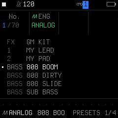
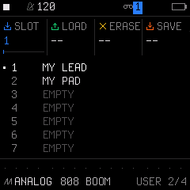
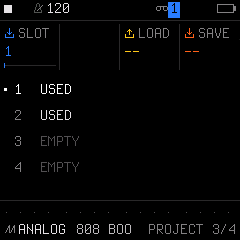
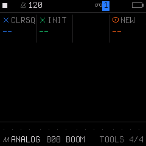

# 08. Presets, Projects & Web Editor Guide

SLOOP includes **32 user sound slots**, **4 project slots**, **fail-safe autosave**, and an **unlimited backup librarian** via the web editor over USB.

---

## 1. The 4 Storage Pages (`SAVE`)

> [!TIP]
> **How to reach these storage pages:**
> If you tap **`SAVE`** while on the main **`HOME`** performance screen, SLOOP opens the **`SONG`** arranger screen.
> To open the 4 storage pages below (`PRESETS`, `USER`, `PROJECT`, `TOOLS`), **first tap any sound design button** (`EDIT`, `ENV`, `LFO`, or `FX`), then tap **`SAVE`**!

### Page 1/4: `PRESETS` (Category Sound Browser & Engine Jump)

While the physical **`PRESETS` encoder knob** on `HOME` scrolls linearly through all 68 sounds one-by-one, **Page 1/4 gives you an instant Engine Selector**:

* **K1 (`No.`):** Scroll through presets one-by-one (Basses, Keys, Leads, Pads, Stabs).
* **K2 (`ENG`):** **Engine Jump!** Instantly switches the active synthesis engine (`ANALOG`, `DIGITAL`, `PHASE`, `LOFI`, `SAMPLE`, `VOICE`, `TRIO`, `WHEEL`, `GRAIN`). The engine name and icon update immediately in column 2.
* **K3 – K4:** Unused on this page.

#### The 68 Factory Sounds by Category

| Kind | Sounds & Engine |
| :--- | :--- |
| **BASS** (16) | • `808 BOOM`, `808 DIRTY`, `808 SLIDE`, `SUB BASS`, `PLUGG BASS`, `REESE`, `WOBBLE`, `ACID 303`, `FUNK BASS` (*ANALOG*) • `FM BASS` (*DIGITAL*) • `CZ BASS` (*PHASE*) • `FAT BASS` (*TRIO*) • `WOW BASS` (*VOICE*) • `GB BASS` (*LOFI*) • `UP BASS`, `DEEP BASS` (*SAMPLE*) |
| **KEYS** (11) | • `RHODES`, `DX RHODES`, `WURLI`, `M1 PIANO`, `AFRO KEYS`, `CLAV` (*DIGITAL*) • `GRAND PNO`, `DUSTY PNO`, `LOFI KEYS` (*SAMPLE*) • `SOFT KEYS` (*PHASE*) |
| **ORGN** (5) | • `SOUL ORGAN`, `GOSPEL`, `JAZZ ORGAN`, `DIRTY B3`, `HOUSE ORGN` (*WHEEL*) |
| **PAD** (10) | • `WARM PAD`, `DARK STR`, `ATMOS PAD` (*ANALOG*) • `SAW PAD` (*TRIO*) • `GLASS PAD` (*DIGITAL*) • `CZ STRING` (*PHASE*) • `LOFI CLOUD`, `VIBE HAZE` (*GRAIN*) • `CHOIR AAH`, `SOUL OOH` (*VOICE*) |
| **LEAD** (8) | • `SUPERSAW`, `G-FUNK LD` (*ANALOG*) • `SYNC LEAD`, `HOOVER` (*TRIO*) • `TALKBOX` (*VOICE*) • `GAME LEAD` (*LOFI*) • `LOFI FLUTE` (*SAMPLE*) • `FLUTE DUST` (*GRAIN*) |
| **PLCK** (9) | • `TRAP PLUCK` (*ANALOG*) • `RESO PLUCK` (*PHASE*) • `PLUGG BELL`, `TRAP BELL`, `MUSIC BOX`, `KALIMBA`, `MARIMBA` (*DIGITAL*) • `VIBES` (*SAMPLE*) • `8BIT ARP` (*LOFI*) |
| **STAB** (7) | • `MIN STAB`, `MIN7 STAB`, `RAVE STAB`, `DUB CHORD` (*TRIO*) • `SYN BRASS` (*ANALOG*) • `CZ BRASS` (*PHASE*) • `HORN STAB`, `STRING STB` (*SAMPLE*) |
| **FX** (2) | • `SCRATCH`, `GM KIT` (*SAMPLE*) |

> [!TIP]
> **Why is there a "GM KIT" in the Synth Presets?**
> * On **Track 4 (Drums)**, the `PRESETS` knob selects complete **Drum Kits** (37 kits: *808*, *909*, *TRAP*, *BOOMBAP*), mapping 16 percussion sounds across the 16 white keys.
> * The **`GM KIT`** listed above is a special factory patch for **Synth Tracks (1, 2, 3)** on the `SAMPLE` engine. It allows you to load an acoustic General MIDI drum kit onto a synth track if you ever want a second auxiliary percussion kit alongside Track 4!

---

### Page 2/4: `USER` (32 User Sound Slots)

Permanently store your own customized sound patches into non-volatile hardware flash:
* **K1 (`SLOT`):** Select user slot **1 to 32** (`U01`..`U32`).
* **K2 (`LOAD`):** Turn twice within 1.5 seconds (`AGAIN: LOAD`) to load this saved sound onto the active track.
* **K3 (`ERASE`):** Turn twice within 1.5 seconds (`AGAIN: ERASE`) to clear/erase this slot.
* **K4 (`SAVE`):** Turn twice within 1.5 seconds (`AGAIN: SAVE`) to write the current track's sound into this slot!
* *Auditioning from Home:* On the main `HOME` screen, turn the physical **`PRESETS`** encoder knob past preset 68 to scroll through all 32 saved user sounds directly while playing.

---

### Page 3/4: `PROJECT` (Slots 1–4 / Sections A–D)

Manages full-machine snapshots across all 4 tracks:
* **K1 (`SLOT`):** Pick slot **1, 2, 3, or 4** (Sections A–D).
* **K2:** Unused on this page.
* **K3 (`LOAD`):** Turn twice to load that project/section.
* **K4 (`SAVE`):** Turn twice to write the current machine state into that project slot.

---

### Page 4/4: `TOOLS` (Maintenance & Reset)

* **K1 (`CLRSQ`):** Clears the sequence pattern on the active track (preserves your sound).
* **K2 (`INIT`):** **INIT SOUND** — resets the active track's sound to neutral init defaults (clean oscillators, flat filter, standard ADSR) while preserving your sequence pattern! Turn twice within 1.5 s (`AGAIN: INIT`) to confirm.
* **K3:** Unused on this page.
* **K4 (`NEW`):** **NEW PROJECT** — wipes all 4 tracks, sequences, and mixer settings to start completely clean. Turn twice to confirm.

---

## 2. Automatic Fail-Safe Autosave

You never have to worry about losing your work if the battery dies:
* Whenever playback is stopped and no notes are sounding, SLOOP automatically writes your working project into flash memory.
* When you power on the FM-1, SLOOP **automatically resumes exactly where you left off**.

---

## 3. Managing Unlimited Songs via the Web Editor

While the hardware holds 1 active song (Sections A–D) at a time, you can store an unlimited library of songs on your computer or phone using the Web Editor:

1. Connect the FM-1 to your computer using a USB-C data cable.
2. Open the editor in **Chrome or Edge**:
   * Double-click **`OPEN-EDITOR.bat`**, or go to `http://localhost:8766/webapp/editor/`.
3. Click **Connect** and allow MIDI access.

### Saving a Song to File
1. In the editor, navigate to the **Projects** tab $\rightarrow$ **Backup**.
2. Click **`Save a backup`**.
3. A `.json` file downloads to your computer containing:
   * All 4 tracks (sounds, levels, effects, patterns).
   * All 4 sections (**A**, **B**, **C**, **D**).
   * The complete Song arrangement chain.
   * All 32 user presets and sample slots.
4. Rename the file after your song (e.g., `Summer_House_Beat.json`).

### Loading Another Song
1. Stop playback on the FM-1.
2. In the web editor, click **`Restore from a file`**.
3. Select your song's `.json` file.
4. In under 2 seconds, SLOOP completely reloads the new song onto your FM-1!

---

## 4. The Sampling & Crate-Digger Guide (`USR1`–`USR3` & `CHOP`)

SLOOP provides **3 user sample slots (`USR1`, `USR2`, `USR3`)**, each holding **~7.4 seconds** of custom audio (80 KiB IMA ADPCM at 44.1 kHz). Samples are stored directly in internal hardware flash memory and can be played polyphonically by the **`SAMPLE`** engine or pulverized into ambient textures by the **`GRAIN`** engine.

> [!IMPORTANT]
> **Common Traps for Sampler Users:**
> 1. **The 3.5 mm jack is MIDI IN, not Audio In!** The FM-1 hardware has no analog audio input jack. You cannot plug in a phone or turntable directly. All samples must be transferred via the Web Editor over USB.
> 2. **User samples live on Synth Tracks (1, 2, 3), NOT Track 4!** Track 4 is dedicated to the 37 internal drum kits. To play your custom chops, select Track 1, 2, or 3 and switch the engine to **`SAMPLE`** with `SET` = `USR1`..`USR3`.
> 3. **The 7.4-Second Limit:** Each slot holds up to 7.4 seconds total across all 16 slices. If your song is longer, use the Web Editor's **`Fit to slot`** button to automatically compress slices to fit.

---

### Step-by-Step: Slicing Audio with `CHOP`

1. Connect the FM-1 to your computer/phone via USB-C and open the Web Editor (`http://localhost:8766/webapp/editor/`).
2. Click **Connect** and select the **Samples** tab.
3. Drag-and-drop any audio file (WAV, MP3, AIFF, FLAC) into the **CHOP** waveform display.
4. **Slice into up to 16 chops:**
   * **`TAP` (or Spacebar):** Tap along in real-time as the file plays (*Snap to hit* automatically snaps your taps to transient attacks!).
   * **`Find hits`:** Automatic transient hit detector.
   * **`Grid` / `Equal parts`:** Slices strictly into musical bar divisions.
5. **Trim & Fit:** Fine-tune start/end slice handles, or click **`Fit to slot`** when the combined length exceeds the 7.4 s limit.
6. Click **`Send to USR1`** (or `USR2` / `USR3`). The editor compresses and writes the slices directly into the FM-1's flash memory over USB!

---

### Step-by-Step: Direct Multi-WAV Import

If you have pre-cut instrument samples (e.g., individual piano notes or bass hits):
* Drop up to 16 individual `.wav` files into a slot.
* Include the target root MIDI note in the filename (e.g. `UPRIGHT_C2.wav` or `KEYS_60.wav`). SLOOP automatically tunes and maps each note across the keyboard!

---

### Playing & Sculpting Chops on the Hardware

Once transferred into `USR1`:

1. **Assign to a Track:** Turn **`ALGORITHM`** to select Track 1, 2, or 3 (e.g. Track 2).
2. **Select Engine & Slot:** Tap **`EDIT`** $\rightarrow$ Tap **`SAVE`** $\rightarrow$ Turn **`KNOB 2 (ENG)`** to **`SAMPLE`**.
3. **Load the Bank:** Tap **`EDIT`** $\rightarrow$ Turn **`KNOB 1 (SET)`** to **`USR1`**.
4. **Trigger Chops:** The **16 white keys** from $F_3$ to $G_5$ now trigger your 16 chops with zero latency!

#### Vintage Sampler Mojo Recipes
* **Snappy One-Shots (No Hanging Rings):** On `EDIT 1`, turn **`KNOB 4 (LOOP)` to `OFF`**. Tap **`ENV`** and keep **`KNOB 4 (REL)`** short so slices cut off cleanly when you let go.
* **12-bit / 8-bit Lo-Fi Grit:** On `EDIT 1`, turn **`KNOB 3 (BITS)`** up to emulate the crunchy downsampling of classic 80s/90s vintage samplers.
* **Warm Damping & Drive:** On `EDIT 2`, turn **`KNOB 1 (CUT)`** to roll off high-end hiss, and **`KNOB 3 (DRV)`** to add warm saturation.
* **Vinyl Dust & Sidechain Ducking:** Hold **`FX`** $\rightarrow$ turn **`KNOB 2 (DUST)`** to inject authentic vinyl crackle and record wear, and **`KNOB 3 (DUCK)`** so every kick on Track 4 ducks your sample chops in rhythm!

#### Transforming Samples into Ambient Clouds (`GRAIN` Engine)
Want evolving ambient soundscapes instead of chops?
1. Switch the track's engine to **`GRAIN`**.
2. On `EDIT 1`, set **`KNOB 1 (SRC)`** to **`USR1`**.
3. Adjust **`POS`** (playhead position), **`SIZE`** (grain duration), and **`DENS`** (spawn density).
4. Your sliced audio is pulverized into an infinite, lush, moving granular cloud!

