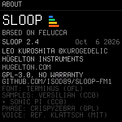
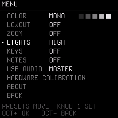
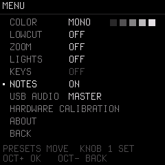
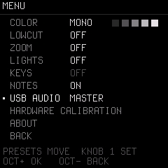

# 09. Settings, MIDI & USB Audio Guide

SLOOP includes a system setup menu, class-compliant USB stereo audio recording, multi-channel MIDI routing, and external clock sync.

---

## 1. The System Menu (Hold `HOME`)

**Hold down `HOME`** for about 1 second to open the system configuration menu:

* **Navigating:** Turn **`PRESETS`** to scroll through menu items. Turn **`KNOB 1`** to adjust the value. Press **`OCT+`** to step round, or **`OCT−`** to close.

### Key Menu Options

#### `COLOR` (UI Display Theme)
* `MONO` (Default), `GREEN`, `AMBER`, `CYAN`, `RED`.
* Selects the 5-shade monochrome palette used for text, labels, borders, and UI backgrounds.
* *Note: The 4 track identity colors (Track 1 Blue, Track 2 Green, Track 3 Yellow, Track 4 Orange) are separate and remain consistent regardless of the selected UI theme.*

#### `LOWCUT` (Sub-bass Rumble Filter)
* `OFF`, `ON`.
* Activates an 80 Hz high-pass filter across master outputs to eliminate low-end mud and DC thump.

#### `ZOOM` (Large Touch Readout)
* `OFF`, `ON`.
* When touching an encoder knob, renders an oversized value readout on the screen for increased visibility.

#### `LIGHTS` (Button Backlight Glow)

* `OFF`, `LOW`, `MID`, `HIGH`.
* Adds a soft background glow to all buttons so you can read their labels on stage or in the dark. Active buttons stay at full brightness.

#### `KEYS` (Keyboard Illumination)
* `OFF`, `C KEYS` (Cs glow for pitch landmarks), `WHITE KEYS` (all white keys glow).

#### `NOTES` (Played-Note Illumination)

* `ON`: Whenever a synth note or drum hit sounds (live or from the sequencer), its corresponding keyboard key lights up in real-time!

#### `USB AUDIO` (Recording Level)

* `MASTER` (Default): The USB audio recording level follows the physical `MASTER` volume knob.
* `FULL`: Fixed maximum digital output level (independent of the headphone knob). Ideal when recording directly into a DAW or audio interface.

---

## 2. MIDI Keyboards & Routing

SLOOP accepts MIDI simultaneously from two sources:
1. **USB MIDI:** From a computer, phone, tablet, or USB MIDI host box.
2. **TRS MIDI IN (3.5mm jack):** From any hardware MIDI keyboard or pad controller via a 3.5mm-to-5-pin DIN MIDI adapter.

### MIDI Channel Map

| MIDI Channel | Destination | Behavior |
| :---: | :--- | :--- |
| **`1`** | **Track 1 (Bass)** | Plays Track 1 synth engine |
| **`2`** | **Track 2 (Keys/Pad)**| Plays Track 2 synth engine |
| **`3`** | **Track 3 (Lead)** | Plays Track 3 synth engine |
| **`10`**| **Track 4 (Drums)** | Standard GM drum mapping triggers the nearest of the 16 drum sounds |
| **`4 – 16`**| **Active Track** | Follows the active track selected by `ALGORITHM` |

---

## 3. External MIDI Clock Sync

To synchronize SLOOP with your DAW, Drumbrute, Elektron box, or external sequencer:

1. Tap **`GLO`** until you reach page **`SYSTEM 3/4`**.
2. Turn **KNOB 2 (`SYNC`)**:
   * `INT`: SLOOP uses its own internal tempo clock.
   * `USB`: Follows incoming MIDI clock over USB.
   * `TRS`: Follows incoming MIDI clock from the 3.5mm MIDI IN jack.
3. When external clock is received:
   * SLOOP follows the master BPM and 24 pulses per quarter note with zero drift.
   * External `START`, `CONTINUE`, and `STOP` commands control SLOOP's playback.
   * If the external clock stops for more than 0.5 seconds, SLOOP seamlessly falls back to its internal tempo.

---

## 4. USB Audio: Record Directly into a Computer or Phone

The M-VAVE FM-1 is a **class-compliant stereo USB audio interface** on SLOOP:

* **Specifications:** 44.1 kHz, 16-bit stereo audio.
* **Plug & Play:** No drivers required on macOS, Windows, Linux, iOS, or Android.
* **Direct Recording:** Open Ableton, Logic, Reaper, Audacity, or a mobile recording app, select **Felucca** as your audio input, and press Record. You will record the clean master stereo mix of your performance directly over the USB-C cable!
