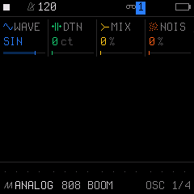
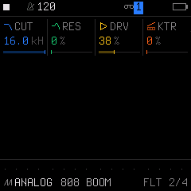

# Engine 01: ANALOG (Virtual Analog)

The **`ANALOG`** engine is a classic virtual analog synthesizer modeled with two band-limited oscillators, a white noise source, saturation drive, and a resonant low-pass filter.

It is accessed by tapping the **`EDIT`** button on Track 1, 2, or 3. Tapping **`EDIT`** repeatedly cycles through all 4 pages in the `EDIT` family:

| Page | Title | Scope | What it controls |
| :---: | :--- | :--- | :--- |
| **1/4** | **`OSC`** | Engine | Oscillator waveforms, detune, mix, and noise |
| **2/4** | **`FLT`** | Engine | 4-pole low-pass filter cutoff, resonance, drive, and key tracking |
| **3/4** | **`VOICE`** | Track Voice | Polyphony mode, portamento glide time, glide mode, and voice priority |
| **4/4** | **`VOICE 2`**| Track Voice | Voice allocation, unison detune spread, stereo pan, and mute |

---

## Page 1/4: `OSC` (Oscillators & Noise)

* **`KNOB 1 (WAVE)`:** Oscillator waveform:
  * `SAW`: Bright, harmonic-rich sawtooth (ideal for synth brass, strings, and leads).
  * `SQR`: Hollow, punchy square wave (classic for funk bass and chiptune).
  * `TRI`: Smooth triangle wave with mild overtones (great for plugg bass and mellow keys).
  * `SIN`: Pure fundamental sine wave (the core of clean sub-bass lines).
  * `PWM`: Pulse-width modulation with animated harmonic movement (warm pads).
* **`KNOB 2 (DTN)`:** Detune in cents (`0` to `127 ct`). Detunes Oscillator 2 against Oscillator 1 to create beating, thickness, and chorusing.
* **`KNOB 3 (MIX)`:** Blend ratio between Oscillator 1 and Oscillator 2 (`0%` to `100%`).
* **`KNOB 4 (NOIS)`:** White noise injection level (`0%` to `100%`). Adds vintage breath, grit, or percussive attack transients.

---

## Page 2/4: `FLT` (Filter & Drive)

* **`KNOB 1 (CUT)`:** Filter Cutoff frequency (`10 Hz` to `20 kHz`). Sweeps the 4-pole low-pass ladder filter.
* **`KNOB 2 (RES)`:** Resonance (`0%` to `100%`). Boosts harmonics around the cutoff frequency. High values generate singing, screaming acid peaks.
* **`KNOB 3 (DRV)`:** Saturation Drive (`0%` to `100%`). Drives the oscillator mix into non-linear analog clipping before the filter stage.
* **`KNOB 4 (KTR)`:** Key Tracking (`0%` to `100%`). Scales filter cutoff relative to played pitch so higher notes retain brightness.

---

## Page 3/4: `VOICE` (Voice Mode & Glide)

* **`KNOB 1 (VCE)`:** Polyphony & Voice Mode:
  * `POLY`: Full 4-voice polyphonic playback.
  * `MONO`: Single-voice monophonic; re-triggers envelopes on every key press.
  * `LEG` (Legato): Monophonic; notes glide smoothly without re-triggering envelopes when played legato.
  * `UNI` (Unison): Stacks all available voice oscillators onto a single note for massive thickness.
* **`KNOB 2 (GLD)`:** Portamento Glide Time (`0` to `127`). Sets pitch slide speed between consecutive notes.
* **`KNOB 3 (GLMOD)`:** Glide Mode:
  * `RATE`: Constant speed (longer distance slides take more time).
  * `TIME`: Constant time (slides always take the same time regardless of interval).
* **`KNOB 4 (PRIO)`:** Monophonic Note Priority:
  * `LAST`: Last-note priority (modern keyboard standard).
  * `LOW`: Lowest-note priority (classic for basslines).
  * `HIGH`: Highest-note priority (classic for lead melody lines).

---

## Page 4/4: `VOICE 2` (Allocation & Stereo)

* **`KNOB 1 (ALLOC)`:** Polyphonic Voice Stealing Algorithm:
  * `ROT` (Rotating): Cycles through voice channels sequentially, allowing long note release tails to ring out.
  * `REUSE`: Reuses the oldest sounding voice.
* **`KNOB 2 (DTUNE)`:** Unison Detune Spread (`0` to `127`). Controls the stereo spread and detuning width when `VCE` is set to `UNI`.
* **`KNOB 3 (PAN)`:** Track Stereo Pan placement (`L64` ... `0` ... `R63`).
* **`KNOB 4 (MUTE)`:** Track Mute (`OFF` or `ON`).

---

## Sound Design Tips

> [!TIP]
> **Crafting Deep Sub-Basses and Slides:**
> 1. Set `WAVE` to `SIN`, `NOIS` to `0%`, and `MIX` to `0%`.
> 2. On Page 2 (`FLT`), open `CUT` completely (`100%`) and add a small amount of `DRV` (`30%–50%`) to create audible second harmonics that cut through small speakers.
> 3. Go to Page 3 (`VOICE`) and set `VCE: LEG` and `GLD: 40–60` for smooth pitch slides.
> 4. Go to **`ENV`** (Page 1) and set `ATK: 0 ms`, `DEC: 600 ms`, `SUS: 0%`, `REL: 200 ms`.
> 5. Go to **`ENV DEST`** (Page 2) and set `PIT: +12` to `+20`. This gives the sub-bass an instant acoustic pitch drop transient on impact!
