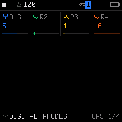
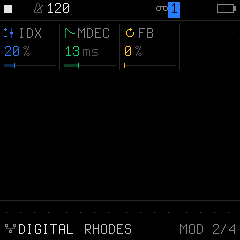

# Engine 02: DIGITAL (4-Operator FM)

The **`DIGITAL`** engine is a 4-operator Frequency Modulation (FM) synthesizer. FM synthesis generates complex, evolving harmonics by using sine oscillators (modulators) to rapidly modulate the frequency of other sine oscillators (carriers).

It is accessed by tapping the **`EDIT`** button on Track 1, 2, or 3. Tapping **`EDIT`** repeatedly cycles through all 4 pages in the `EDIT` family:

| Page | Title | Scope | What it controls |
| :---: | :--- | :--- | :--- |
| **1/4** | **`OPS`** | Engine | 4-operator algorithm topology and frequency ratios R2, R3, R4 |
| **2/4** | **`MOD`** | Engine | FM modulation index depth, modulator decay time, and feedback |
| **3/4** | **`VOICE`** | Track Voice | Polyphony mode, portamento glide time, glide mode, and voice priority |
| **4/4** | **`VOICE 2`**| Track Voice | Voice allocation, unison detune spread, stereo pan, and mute |

---

## Page 1/4: `OPS` (FM Algorithm & Operator Ratios)

* **`KNOB 1 (ALG)`:** FM Algorithm (`1` to `8`). Selects the routing matrix topology connecting the 4 operators (which operators act as audible carriers vs. modulating sources). An interactive routing diagram is displayed in the visual graph area.
* **`KNOB 2 (R2)`:** Frequency Ratio of Operator 2 relative to the base pitch (`.5`, `1`, `2`, `3`, `4`, `5`, `6`, `7`, `8`, `9`, `10`, `11`, `12`, `14`, `16`).
* **`KNOB 3 (R3)`:** Frequency Ratio of Operator 3 (`.5`, `1`, `2`, `3`, `4`, `5`, `6`, `7`, `8`, `9`, `10`, `11`, `12`, `14`, `16`). Integer ratios create harmonic overtones (bells, pianos), while fractional ratios produce metallic, inharmonic textures.
* **`KNOB 4 (R4)`:** Frequency Ratio of Operator 4 (`.5`, `1`, `2`, `3`, `4`, `5`, `6`, `7`, `8`, `9`, `10`, `11`, `12`, `14`, `16`).

---

## Page 2/4: `MOD` (Modulation Depth & Feedback)

* **`KNOB 1 (IDX)`:** Modulation Index (`0%` to `100%`). Controls the overall depth of FM modulation applied by modulators to carriers. Higher values introduce rich, bright metallic harmonics.
* **`KNOB 2 (MDEC)`:** Modulator Decay Time (`0` to `127`). Controls how quickly the FM brightness decays over the duration of the note. Short decay creates punchy transients (electric piano tine strikes, bell attacks, guitar plucks), while long decay produces shimmering pads.
* **`KNOB 3 (FB)`:** Feedback Amount (`0%` to `100%`). Feeds Operator 4 back into itself to produce complex brassy waveforms and noise-like grit at extreme settings.
* **`KNOB 4 (-)`:** Unused on this page.

---

## Page 3/4: `VOICE` (Voice Mode & Glide)

* **`KNOB 1 (VCE)`:** Polyphony & Voice Mode (`POLY`, `MONO`, `LEG`, `UNI`).
* **`KNOB 2 (GLD)`:** Portamento Glide Time (`0` to `127`).
* **`KNOB 3 (GLMOD)`:** Glide Mode (`RATE` vs `TIME`).
* **`KNOB 4 (PRIO)`:** Monophonic Note Priority (`LAST`, `LOW`, `HIGH`).

---

## Page 4/4: `VOICE 2` (Allocation & Stereo)

* **`KNOB 1 (ALLOC)`:** Voice Stealing Algorithm (`ROT` rotating vs `REUSE`).
* **`KNOB 2 (DTUNE)`:** Unison Detune Spread (`0` to `127`).
* **`KNOB 3 (PAN)`:** Stereo Pan placement (`L64` ... `0` ... `R63`).
* **`KNOB 4 (MUTE)`:** Track Mute (`OFF` or `ON`).

---

## Sound Design Tips

> [!TIP]
> **Creating Crisp Electric Piano Bell Tines:**
> 1. Select Algorithm `ALG: 1` or `2`.
> 2. On Page 1 (`OPS`), set `R4` to a high ratio (e.g. `7` or `14`). This places Operator 4 in the upper overtone spectrum.
> 3. On Page 2 (`MOD`), set `MDEC` short (`15` to `35`) and increase `IDX` (`65%` to `80%`). When striking keys, you will hear a sharp metallic bell-like hammer bite on the attack that quickly mellows into warm electric keys!
