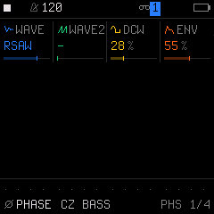
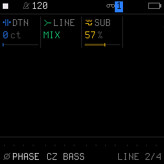

# Engine 03: PHASE (Phase Distortion)

The **`PHASE`** engine implements authentic Phase Distortion (PD) synthesis. Instead of filtering harmonically dense waveforms, Phase Distortion alters the reading speed of a pure sine lookup table to synthesize saws, squares, and resonant filter sweeps without conventional analog filters.

It is accessed by tapping the **`EDIT`** button on Track 1, 2, or 3. Tapping **`EDIT`** repeatedly cycles through all 4 pages in the `EDIT` family:

| Page | Title | Scope | What it controls |
| :---: | :--- | :--- | :--- |
| **1/4** | **`PHS`** | Engine | Waveforms, alternate wave, DCW distortion, and envelope depth |
| **2/4** | **`LINE`** | Engine | Line 2 detune, ring modulation, and sub-oscillator |
| **3/4** | **`VOICE`** | Track Voice | Polyphony mode, portamento glide time, glide mode, and voice priority |
| **4/4** | **`VOICE 2`**| Track Voice | Voice allocation, unison detune spread, stereo pan, and mute |

---

## Page 1/4: `PHS` (Waveforms & DCW Bend)

* **`KNOB 1 (WAVE)`:** Primary Phase Distortion waveform:
  * `SAW`: Phase-distorted sawtooth.
  * `SQR`: Phase-distorted square wave.
  * `PLS`: Narrow digital pulse.
  * `DSIN`: Double sine wave (octave up).
  * `SPLS`: Asymmetrical saw-pulse combination.
  * `RSAW`: Resonant sawtooth sweep.
  * `RTRI`: Resonant triangle sweep.
  * `RTRP`: Resonant trapezoid sweep.
* **`KNOB 2 (WAVE2)`:** Alternate waveform (`-` for off, or `SAW`, `SQR`, `PLS`, `DSIN`, `SPLS`, `RSAW`, `RTRI`, `RTRP`). When active, the oscillator alternates between `WAVE` and `WAVE2` on alternating cycles, creating complex compound timbres.
* **`KNOB 3 (DCW)`:** Digitally Controlled Waveform depth (`0%` to `100%`). The core Phase Distortion control—acts like a brightness and overtone control by determining how severely the phase angle is bent.
* **`KNOB 4 (ENV)`:** Envelope-to-DCW modulation depth (`0%` to `100%`). Routes the amplitude envelope to open up DCW brightness dynamically on each note trigger.

---

## Page 2/4: `LINE` (Line 2, Detune & Sub)

* **`KNOB 1 (DTN)`:** Line 2 Detune in cents (`0` to `127 ct`). Detunes the dual synthesizer line for rich chorusing.
* **`KNOB 2 (LINE)`:** Line Configuration:
  * `MIX`: Normal stereo/dual-line blend.
  * `RING`: Digital ring modulation between Line 1 and Line 2 for bell and metallic tones.
* **`KNOB 3 (SUB)`:** Sub-oscillator level (`0%` to `100%`). Adds a pure low-octave sine reinforcement beneath the sound.
* **`KNOB 4 (-)`:** Unused on this page.

---

## Page 3/4: `VOICE` (Voice Mode & Glide)

* **`KNOB 1 (VCE)`:** Polyphony & Voice Mode (`POLY`, `MONO`, `LEG`, `UNI`).
* **`KNOB 2 (GLD)`:** Portamento Glide Time (`0` to `127`).
* **`KNOB 3 (GLMOD)`:** Glide Mode (`RATE` vs `TIME`).
* **`KNOB 4 (PRIO)`:** Monophonic Note Priority (`LAST`, `LOW`, `HIGH`).

---

## Page 4/4: `VOICE 2` (Allocation & Stereo)

* **`KNOB 1 (ALLOC)`:** Voice Stealing Algorithm (`ROT` rotating vs `REUSE`).
* **`KNOB 2 (DTUNE)`:** Unison Detune Spread (`0` to `127`).
* **`KNOB 3 (PAN)`:** Stereo Pan placement (`L64` ... `0` ... `R63`).
* **`KNOB 4 (MUTE)`:** Track Mute (`OFF` or `ON`).

---

## Sound Design Tips

> [!TIP]
> **Glassy Resonant Sweeps:**
> 1. Select `WAVE: RSAW` or `RTRP`.
> 2. On Page 1 (`PHS`), set `DCW` to around `30%` and `ENV` to `80%`.
> 3. Go to **`ENV`** and adjust `DEC` to taste. You will hear an eerie, resonant filter sweep that has a distinct, glassy digital character.
