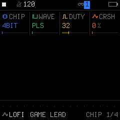
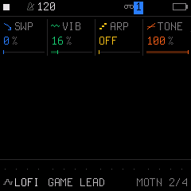

# Engine 04: LOFI (Chiptune & Lo-Fi Synthesis)

The **`LOFI`** engine generates raw, retro chiptune sounds with authentic digital characteristics: coarse bit depths (1-bit, 4-bit, 8-bit), stepped staircase waveforms, sample rate reduction, pitch sweeps, and high-speed pseudo-arpeggios.

It is accessed by tapping the **`EDIT`** button on Track 1, 2, or 3. Tapping **`EDIT`** repeatedly cycles through all 4 pages in the `EDIT` family:

| Page | Title | Scope | What it controls |
| :---: | :--- | :--- | :--- |
| **1/4** | **`CHIP`** | Engine | Chip mode, waveform selection, duty cycle / wave table, and bitcrush / decay |
| **2/4** | **`MOTN`** | Engine | Pitch sweep, vibrato, hardware-style arpeggiator, and tone filter |
| **3/4** | **`VOICE`** | Track Voice | Polyphony mode, portamento glide time, glide mode, and voice priority |
| **4/4** | **`VOICE 2`**| Track Voice | Voice allocation, unison detune spread, stereo pan, and mute |

---

## Page 1/4: `CHIP` (Sound Chip Architecture)

* **`KNOB 1 (CHIP)`:** Sound Chip Architecture:
  * `4BIT`: 4-bit quantization with stepped amplitude staircase.
  * `4B/2`: 4-bit resolution with clock-divided half-rate downsampling.
  * `8BIT`: 8-bit quantization for cleaner, punchy retro tone.
  * `1BIT`: Extreme 1-bit pulse switching for aggressive, fuzz-like square-wave distortion.
  * `STEP`: Stepped volume envelope mode where a 16-level decay staircase replaces the standard ADSR curve.
* **`KNOB 2 (WAVE)`:** Oscillator Waveform:
  * `PLS`: Pulse wave with variable duty cycle.
  * `TRI`: 4-bit stepped staircase triangle wave.
  * `SAW`: Stepped sawtooth wave.
  * `NOIS`: Pseudo-random LFSR noise for retro percussion, explosions, and snare hits.
  * `WRAM`: 4-bit 32-sample wave RAM playing 16 built-in wavetables.
* **`KNOB 3 (DUTY)`:** Pulse Width / Duty Cycle (`12.5%`, `25%`, `37.5%`, `50%`). When `WAVE` is set to `WRAM`, this knob switches to **`WAV#`** to choose from 16 custom wavetables (`SQ50`, `SQ25`, `SQ12`, `SINE`, `TRI`, `SAW`, `SAW2`, `BAS1`, `BAS2`, `ORGN`, `HOLW`, `VOXA`, `VOXO`, `VOXE`, `BUZZ`, `STAIR`).
* **`KNOB 4 (CRSH)`:** Sample rate reduction & Bitcrush depth (`0%` to `100%`). When `CHIP` is set to `STEP`, this knob switches to **`DCY`** to select the stepped decay envelope (`CONST`, one-shot decays `D0`–`D15`, or looping decays `L1`–`L15`).

---

## Page 2/4: `MOTN` (Pitch Sweeps & Chip Arpeggios)

* **`KNOB 1 (SWP)`:** Pitch Sweep Speed (`0%` to `100%`). Bends pitch rapidly downward on note attack for laser shots and percussive drops.
* **`KNOB 2 (VIB)`:** Chip Vibrato Depth (`0%` to `100%`). Adds retro pitch wobble.
* **`KNOB 3 (ARP)`:** High-Speed Chip Arpeggio:
  * `OFF`: Normal polyphonic or monophonic playing.
  * `OCT`: Rapid octave cycling.
  * `MAJ`: Rapid Major triad chord roll (root, 3rd, 5th).
  * `MIN`: Rapid Minor triad chord roll (root, minor 3rd, 5th).
* **`KNOB 4 (TONE)`:** 1-pole high-cut tone damping filter (`0%` to `100%`).

---

## Page 3/4: `VOICE` (Voice Mode & Glide)

* **`KNOB 1 (VCE)`:** Polyphony & Voice Mode (`POLY`, `MONO`, `LEG`, `UNI`).
* **`KNOB 2 (GLD)`:** Portamento Glide Time (`0` to `127`).
* **`KNOB 3 (GLMOD)`:** Glide Mode (`RATE` vs `TIME`).
* **`KNOB 4 (PRIO)`:** Monophonic Note Priority (`LAST`, `LOW`, `HIGH`).

---

## Page 4/4: `VOICE 2` (Allocation & Stereo)

* **`KNOB 1 (ALLOC)`:** Voice Stealing Algorithm (`ROT` rotating vs `REUSE`).
* **`KNOB 2 (DTUNE)`:** Unison Detune Spread (`0` to `127`).
* **`KNOB 3 (PAN)`:** Stereo Pan placement (`L64` ... `0` ... `R63`).
* **`KNOB 4 (MUTE)`:** Track Mute (`OFF` or `ON`).

---

## Sound Design Tips

> [!TIP]
> **Classic Rolled Arpeggio Chords:**
> 1. Set `CHIP` to `4BIT` and `WAVE` to `PLS`.
> 2. On Page 2 (`MOTN`), turn `ARP` to `MAJ` (Major) or `MIN` (Minor).
> 3. Trigger single notes across your keyboard—the engine will rapidly cycle through the triad notes at high speed, giving the unmistakable rolling chord illusion of vintage hardware sound chips!
