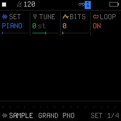
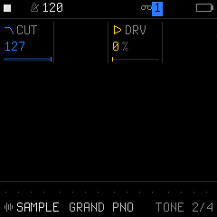

# Engine 05: SAMPLE (Multisampled Instruments)

The **`SAMPLE`** engine plays compressed multi-zone acoustic and electro-mechanical instrument samples stored in internal flash ROM (and user sample slots). Samples are pitched and interpolated in real time across the full MIDI keyboard range.

It is accessed by tapping the **`EDIT`** button on Track 1, 2, or 3. Tapping **`EDIT`** repeatedly cycles through all 4 pages in the `EDIT` family:

| Page | Title | Scope | What it controls |
| :---: | :--- | :--- | :--- |
| **1/4** | **`SET`** | Engine | Multisample set selection, transpose tuning, bit depth, and looping |
| **2/4** | **`TONE`** | Engine | High-frequency tone control and saturation drive |
| **3/4** | **`VOICE`** | Track Voice | Polyphony mode, portamento glide time, glide mode, and voice priority |
| **4/4** | **`VOICE 2`**| Track Voice | Voice allocation, unison detune spread, stereo pan, and mute |

---

## Page 1/4: `SET` (Sample Selection & Playback)

* **`KNOB 1 (SET)`:** Multisample Set:
  * Factory instrument sets: `PIANO`, `BASS`, `VIBES`, `HORNS`, `STRGS` (Strings), `FLUTE`, `SCRCH` (Vinyl Scratch), `PERC` (Percussion).
  * User sample banks: `USR1`, `USR2`, `USR3`.
* **`KNOB 2 (TUNE)`:** Pitch transposition in semitones (`-24` to `+24 st`).
* **`KNOB 3 (BITS)`:** Bit Reduction (`0` to `127`). Emulates classic vintage hardware samplers by reducing bit depth down to crunchy lo-fi grit.
* **`KNOB 4 (LOOP)`:** Sample looping mode (`OFF` or `ON`). When enabled, sustained notes loop seamlessly; when disabled, samples decay naturally as one-shots.

---

## Page 2/4: `TONE` (Tone Shaping & Drive)

* **`KNOB 1 (CUT)`:** High-frequency tone damping (`0` to `127`). Damps high-frequency brightness for a warm, mellow timbre.
* **`KNOB 2 (-)`:** Unused on this page.
* **`KNOB 3 (DRV)`:** Saturation Drive (`0%` to `100%`). Adds tape-style warmth and harmonic compression to the sampled instrument.
* **`KNOB 4 (-)`:** Unused on this page.

---

## Page 3/4: `VOICE` (Voice Mode & Glide)

* **`KNOB 1 (VCE)`:** Polyphony & Voice Mode (`POLY`, `MONO`, `LEG`, `UNI`).
* **`KNOB 2 (GLD)`:** Portamento Glide Time (`0` to `127`).
* **`KNOB 3 (GLMOD)`:** Glide Mode (`RATE` vs `TIME`).
* **`KNOB 4 (PRIO)`:** Monophonic Note Priority (`LAST`, `LOW`, `HIGH`).

---

## Page 4/4: `VOICE 2` (Allocation & Stereo)

* **`KNOB 1 (ALLOC)`:** Voice Stealing Algorithm (`ROT` rotating vs `REUSE`).
* **`KNOB 2 (DTUNE)`:** Unison Detune Spread (`0` to `127`).
* **`KNOB 3 (PAN)`:** Stereo Pan placement (`L64` ... `0` ... `R63`).
* **`KNOB 4 (MUTE)`:** Track Mute (`OFF` or `ON`).

---

## Sound Design Tips

> [!TIP]
> **Dusty Vintage Sampler Flavor:**
> 1. Select the `PIANO` or `BASS` sample set.
> 2. On Page 1 (`SET`), set `BITS` to around `40–60`.
> 3. On Page 2 (`TONE`), set `DRV` to `25%` and lower `CUT` slightly.
> 4. Go to **`GLO`** $\rightarrow$ **`MASTER`** and dial in `DUST` (vinyl crackle) and `FILT` (subtle low-pass muffling). The result captures the warm character of sampling from vintage vinyl records!
