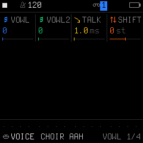
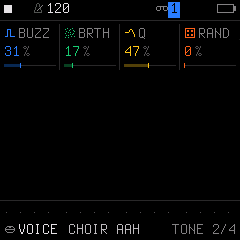
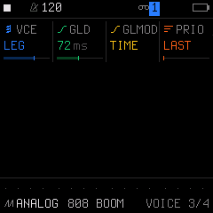
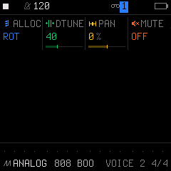

# Engine 06: VOICE (Formant Vocal Synthesis)

The **`VOICE`** engine uses a physical formant filter model (vocal tract simulation with 4 resonant formant peaks, glottal pulse excitation, and breath noise). It synthesizes human vowels (A, E, I, O, U) and dynamic vocal transitions.

It is accessed by tapping the **`EDIT`** button on Track 1, 2, or 3. Tapping **`EDIT`** repeatedly cycles through all 4 pages in the `EDIT` family:

| Page | Title | Scope | What it controls |
| :---: | :--- | :--- | :--- |
| **1/4** | **`VOWL`** | Engine | Vowel shape morphing (A, E, I, O, U), transition speed, and throat shift |
| **2/4** | **`TONE`** | Engine | Glottal buzz, breath noise, formant resonance peak Q, and random drift |
| **3/4** | **`VOICE`** | Track Voice | Polyphony mode, portamento glide time, glide mode, and voice priority |
| **4/4** | **`VOICE 2`**| Track Voice | Voice allocation, unison detune spread, stereo pan, and mute |

---

## Page 1/4: `VOWL` (Vowel Shaping & Articulation)

* **`KNOB 1 (VOWL)`:** Initial vowel form (`0` to `127`). Continuously sweeps across human vowel mouth shapes from **A** $\rightarrow$ **E** $\rightarrow$ **I** $\rightarrow$ **O** $\rightarrow$ **U**.
* **`KNOB 2 (VOWL2)`:** Target vowel form (`0` to `127`). The end vowel that the voice morphs toward during each note.
* **`KNOB 3 (TALK)`:** Morph speed / transition time (`0` to `127`). Controls how rapidly the voice articulates from `VOWL` to `VOWL2` on note trigger.
* **`KNOB 4 (SHIFT)`:** Formant frequency shift in semitones (`-12` to `+12 st`). Adjusting this changes the virtual vocal tract size (throat length), shifting from a deep chest voice down to child or soprano vocal characteristics without altering played musical pitch.

---

## Page 2/4: `TONE` (Vocal Cord Timbre & Breath)

* **`KNOB 1 (BUZZ)`:** Glottal Buzz / Vocal drive (`0%` to `100%`). Controls vocal cord closure intensity. Low values produce soft humming; high values produce raspy, robotic buzz.
* **`KNOB 2 (BRTH)`:** Breath Noise (`0%` to `100%`). Injects aspirate air turbulence for whispers and airy choir textures.
* **`KNOB 3 (Q)`:** Formant Resonance Peak Q (`0%` to `100%`). Sharpening the formant peaks increases vowel clarity and nasal presence.
* **`KNOB 4 (RAND)`:** Random Vowel Drift (`0%` to `100%`). Adds human micro-variations to every triggered note.

---

## Page 3/4: `VOICE` (Voice Mode & Glide)

* **`KNOB 1 (VCE)`:** Polyphony & Voice Mode (`POLY`, `MONO`, `LEG`, `UNI`).
* **`KNOB 2 (GLD)`:** Portamento Glide Time (`0` to `127`).
* **`KNOB 3 (GLMOD)`:** Glide Mode (`RATE` vs `TIME`).
* **`KNOB 4 (PRIO)`:** Monophonic Note Priority (`LAST`, `LOW`, `HIGH`).

---

## Page 4/4: `VOICE 2` (Allocation & Stereo)

* **`KNOB 1 (ALLOC)`:** Voice Stealing Algorithm (`ROT` rotating vs `REUSE`).
* **`KNOB 2 (DTUNE)`:** Unison Detune Spread (`0` to `127`).
* **`KNOB 3 (PAN)`:** Stereo Pan placement (`L64` ... `0` ... `R63`).
* **`KNOB 4 (MUTE)`:** Track Mute (`OFF` or `ON`).

---

## Sound Design Tips

> [!TIP]
> **Creating Funk / Talkbox Vocal Leads:**
> 1. Select a vocal lead preset.
> 2. On Page 1 (`VOWL`), set `VOWL` to `30` (an "E" shape) and `VOWL2` to `95` (an "O" shape).
> 3. Set `TALK` to `45–60` so the mouth closes audibly on each hit ("E-OWW").
> 4. Go to Page 3 (`VOICE`) and set `VCE: LEG` and `GLD: 50–70` in legato mode. When playing overlapping notes, notes slide smoothly like a classic hardware talkbox!
