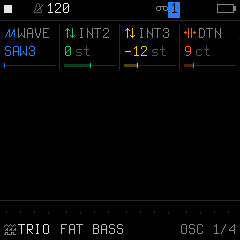
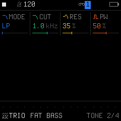

# Engine 07: TRIO (3-Oscillator Monster)

The **`TRIO`** engine features three independently tunable, band-limited oscillators running through a 12 dB/oct multimode resonant filter. By tuning the second and third oscillators in semitones, it generates massive unison stacks, supersaws, hoover leads (*HOOVER*), hard-sync leads (*SYNC LEAD*), and classic one-finger rave stabs (*RAVE STAB*, *DUB CHORD*).

It is accessed by tapping the **`EDIT`** button on Track 1, 2, or 3. Tapping **`EDIT`** repeatedly cycles through all 4 pages in the `EDIT` family:

| Page | Title | Scope | What it controls |
| :---: | :--- | :--- | :--- |
| **1/4** | **`OSC`** | Engine | Triple-oscillator waveforms / routing, semitone intervals, and micro-detuning |
| **2/4** | **`TONE`** | Engine | Multimode filter type (LP / BP / HP / NOT), cutoff, resonance, and pulse width |
| **3/4** | **`VOICE`** | Track Voice | Polyphony mode, portamento glide time, glide mode, and voice priority |
| **4/4** | **`VOICE 2`**| Track Voice | Voice allocation, unison detune spread, stereo pan, and mute |

---

## Page 1/4: `OSC` (3-Oscillator Harmony & Detune)

* **`KNOB 1 (WAVE)`:** Triple-oscillator waveform combination and interaction mode (16 choices):
  * `SAW3`: Three sawtooth waves (classic supersaw).
  * `PLS3`: Three pulse waves.
  * `PPT`: Two pulse waves + one triangle wave.
  * `SST`: Two sawtooth waves + one triangle wave.
  * `TRI3`: Three triangle waves.
  * `S&T`: Two combined Saw-AND-Triangle waves + one triangle wave.
  * `P&S`: Two combined Pulse-AND-Saw waves + one triangle wave.
  * `P+N`: Pulse wave + pitched noise.
  * `NOIS`: Pitched noise generator.
  * `SYNC`: Hard sync (Oscillator 2 hard-synced to Oscillator 1).
  * `SYNCP`: Hard sync with pulse waves.
  * `SYNC3`: Hard sync with 3 oscillators (Saws + Triangle).
  * `RING`: Ring modulation (Oscillator 1 multiplied/sign-flipped with Oscillator 3).
  * `RING3`: Ring modulation with 3 oscillators.
  * `R+S`: Ring modulation + hard sync combined.
  * `R+SP`: Ring modulation + hard sync with pulse waves.
* **`KNOB 2 (INT2)`:** Pitch interval of Oscillator 2 in semitones (`-24` to `+24 st`). Tune to `+3` for a minor third, `+7` for a fifth, or `+12` for an octave up.
* **`KNOB 3 (INT3)`:** Pitch interval of Oscillator 3 in semitones (`-24` to `+24 st`). Tune to `+7` or `+10` to produce instant 3-note chords with a single key press!
* **`KNOB 4 (DTN)`:** Micro-detune in cents (`0` to `50 ct`). Detunes Oscillator 2 up and Oscillator 3 down for symmetrical, thick chorused unison.

---

## Page 2/4: `TONE` (Multimode Filter & Pulse Width)

* **`KNOB 1 (MODE)`:** 12 dB/oct Multimode State Variable Filter (SVF):
  * `LP`: Low-Pass filter (warm bass, brass, and classic synth leads).
  * `BP`: Band-Pass filter with saturated, compressed resonance for vocal and nasal cuts.
  * `HP`: High-Pass filter (thin, sizzling top textures).
  * `NOT`: Notch / Band-Reject filter (hollow, phaser-like sweeps).
* **`KNOB 2 (CUT)`:** Filter Cutoff frequency (`10 Hz` to `20 kHz`). Modulated dynamically by envelope/LFO via track routing to `FLT`.
* **`KNOB 3 (RES)`:** Filter Resonance (`0%` to `100%`). Boosts the cutoff boundary into screaming peaks with analog saturation.
* **`KNOB 4 (PW)`:** Pulse Width (`0%` to `100%`). Controls duty-cycle symmetry across all active pulse oscillator waves. Modulated dynamically when envelopes or LFOs are routed to `SHP`.

---

## Page 3/4: `VOICE` (Voice Mode & Glide)

* **`KNOB 1 (VCE)`:** Polyphony & Voice Mode (`POLY`, `MONO`, `LEG`, `UNI`).
* **`KNOB 2 (GLD)`:** Portamento Glide Time (`0` to `127`).
* **`KNOB 3 (GLMOD)`:** Glide Mode (`RATE` vs `TIME`).
* **`KNOB 4 (PRIO)`:** Monophonic Note Priority (`LAST`, `LOW`, `HIGH`).

---

## Page 4/4: `VOICE 2` (Allocation & Stereo)

* **`KNOB 1 (ALLOC)`:** Voice Stealing Algorithm (`ROT` rotating vs `REUSE`).
* **`KNOB 2 (DTUNE)`:** Unison Detune Spread (`0` to `127`).
* **`KNOB 3 (PAN)`:** Stereo Pan placement (`L64` ... `0` ... `R63`).
* **`KNOB 4 (MUTE)`:** Track Mute (`OFF` or `ON`).

---

## Sound Design Tips

> [!TIP]
> **Building a Classic Dub Techno / Rave Chord Stab:**
> 1. Select the `TRIO` engine.
> 2. On Page 1 (`OSC`), set `WAVE: SAW3` (or `SST`), `INT2: +3` (Minor 3rd), and `INT3: +7` (Fifth) or `+10` (Minor 7th).
> 3. Add a touch of detune (`DTN: 8–12 ct`).
> 4. On Page 2 (`TONE`), set `MODE: LP`, `CUT: 65`, and `RES: 35%`.
> 5. Go to Page 3 (`VOICE`) and ensure `VCE` is in `POLY` or `MONO` depending on whether you want chord stabs or basslines.
> 6. Go to **`FX`** $\rightarrow$ **`DLY`** and dial in heavy tempo-synced tape delay (`TIME: 3/16`, `FDBK: 75%`, `MIX: 50%`). Every single note you play instantly triggers a rich, hypnotic Detroit/Berlin dub chord!
