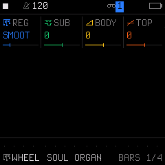
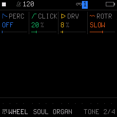

# Engine 08: WHEEL (Tonewheel Organ)

The **`WHEEL`** engine simulates a vintage tonewheel electric organ. It combines 9 harmonic drawbar partials (16', 5 1/3', 8', 4', 2 2/3', 2', 1 3/5', 1 1/3', 1') with mechanical key-click transients, harmonic percussion (2nd and 3rd harmonics), tube overdrive, and a dual-speed rotary speaker simulation.

It is accessed by tapping the **`EDIT`** button on Track 1, 2, or 3. Tapping **`EDIT`** repeatedly cycles through all 4 pages in the `EDIT` family:

| Page | Title | Scope | What it controls |
| :---: | :--- | :--- | :--- |
| **1/4** | **`BARS`** | Engine | 16 drawbar registrations and sub, body, top drawbar trims |
| **2/4** | **`TONE`** | Engine | Harmonic percussion, key-click bounce, tube overdrive, and rotary speed |
| **3/4** | **`VOICE`** | Track Voice | Polyphony mode, portamento glide time, glide mode, and voice priority |
| **4/4** | **`VOICE 2`**| Track Voice | Voice allocation, unison detune spread, stereo pan, and mute |

---

## Page 1/4: `BARS` (Drawbar Registrations)

* **`KNOB 1 (REG)`:** Drawbar Preset Registration (16 classic configurations):
  * `FLUTE`, `MELLO`, `HOLLW`, `SMOOT`, `3BAR`, `BLUES`, `GOSPL`, `ROCK`, `TOPS`, `CLARI`, `REED`, `STRNG`, `CHAPL`, `BRITE`, `BASS`, `FULL`.
  * The visual graph displays the 9 physical drawbar pull levels in real time.
* **`KNOB 2 (SUB)`:** Sub Drawbar Offset (`-8` to `+8`). Trims the low bass drawbars (16' and 5 1/3').
* **`KNOB 3 (BODY)`:** Mid Drawbar Offset (`-8` to `+8`). Trims fundamental body drawbars (8' and 4').
* **`KNOB 4 (TOP)`:** High Drawbar Offset (`-8` to `+8`). Trims high brilliance drawbars (2 2/3' through 1').

---

## Page 2/4: `TONE` (Percussion, Click, Drive & Rotary)

* **`KNOB 1 (PERC)`:** Harmonic Percussion:
  * `OFF`: Percussion disabled (continuous sustain).
  * `2ND`: 2nd harmonic percussion.
  * `3RD`: 3rd harmonic percussion (the classic jazz "ping" attack).
  * `2SOFT`: 2nd harmonic soft decay.
  * `3SOFT`: 3rd harmonic soft decay.
  * `2SLOW`: 2nd harmonic slow decay.
  * `3SLOW`: 3rd harmonic slow decay.
* **`KNOB 2 (CLICK)`:** Mechanical Key-Click Level (`0%` to `100%`). Simulates the authentic electrical contact bounce when keys hit the busbars.
* **`KNOB 3 (DRV)`:** Preamp Overdrive (`0%` to `100%`). Drives the organ signal into warm, gritty blues and rock tube distortion.
* **`KNOB 4 (ROTR)`:** Rotary Speaker Speed:
  * `OFF`: Rotor motors halted.
  * `SLOW`: Gentle, swirling chorusing speed.
  * `FAST`: Rapid tremolo / Doppler shimmer.
  * *Note: Switching between SLOW and FAST realistically models the inertia and spin-up/spin-down lag of physical wooden horns and bass rotors.*

---

## Page 3/4: `VOICE` (Voice Mode & Glide)

* **`KNOB 1 (VCE)`:** Polyphony & Voice Mode (`POLY`, `MONO`, `LEG`, `UNI`).
* **`KNOB 2 (GLD)`:** Portamento Glide Time (`0` to `127`).
* **`KNOB 3 (GLMOD)`:** Glide Mode (`RATE` vs `TIME`).
* **`KNOB 4 (PRIO)`:** Monophonic Note Priority (`LAST`, `LOW`, `HIGH`).

---

## Page 4/4: `VOICE 2` (Allocation & Stereo)

* **`KNOB 1 (ALLOC)`:** Voice Stealing Algorithm (`ROT` rotating vs `REUSE`).
* **`KNOB 2 (DTUNE)`:** Unison Detune Spread (`0` to `127`).
* **`KNOB 3 (PAN)`:** Stereo Pan placement (`L64` ... `0` ... `R63`).
* **`KNOB 4 (MUTE)`:** Track Mute (`OFF` or `ON`).

---

## Sound Design Tips

> [!TIP]
> **Dialing in a Punchy 90s House & Club Organ:**
> 1. Select the *HOUSE ORGN* preset (or set `REG` to `FULL` or `3BAR`).
> 2. On Page 2 (`TONE`), set `PERC` to `2ND` (or `2SOFT`) and increase `CLICK` to `80%`.
> 3. Set `ROTR` to `OFF` (club organs were typically recorded direct without rotary rotation for maximum percussive punch).
> 4. Go to **`ENV`** and ensure `REL` is short (`20–30 ms`). You now have the tight, punchy percussive organ chord sound of early 90s dance music!
