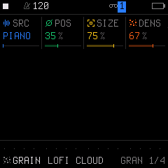
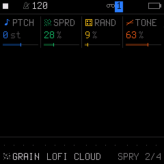

# Engine 09: GRAIN (Granular Cloud)

The **`GRAIN`** engine is a real-time granular synthesizer. It deconstructs internal acoustic sample sets (pianos, vibraphones, flutes, strings) into microscopic sound particles (grains) of variable duration, density, and pitch, spraying them into a lush, evolving ambient cloud.

It is accessed by tapping the **`EDIT`** button on Track 1, 2, or 3. Tapping **`EDIT`** repeatedly cycles through all 4 pages in the `EDIT` family:

| Page | Title | Scope | What it controls |
| :---: | :--- | :--- | :--- |
| **1/4** | **`GRAN`** | Engine | Source sample set, playhead position, grain size, and spawn density |
| **2/4** | **`SPRY`** | Engine | Grain pitch shift, stereo spray spread, random drift, and tone filter |
| **3/4** | **`VOICE`** | Track Voice | Polyphony mode, portamento glide time, glide mode, and voice priority |
| **4/4** | **`VOICE 2`**| Track Voice | Voice allocation, unison detune spread, stereo pan, and mute |

---

## Page 1/4: `GRAN` (Granular Cloud Core)

* **`KNOB 1 (SRC)`:** Source Sample Material:
  * Factory instrument sets: `PIANO`, `BASS`, `VIBES`, `HORNS`, `STRGS` (Strings), `FLUTE`, `SCRCH` (Vinyl Scratch), `PERC` (Percussion).
  * User sample banks: `USR1`, `USR2`, `USR3`.
* **`KNOB 2 (POS)`:** Sample Playback Position (`0%` to `100%`). Sets the central point in the source sample where grains are spawned.
* **`KNOB 3 (SIZE)`:** Grain Duration (`0%` to `100%`). Short grain sizes create percussive, glitchy, stuttering clicks; long grain sizes produce smooth, overlapping orchestral washes.
* **`KNOB 4 (DENS)`:** Grain Density (`0%` to `100%`). Controls how many grains are spawned per second (from sparse raindrops to an opaque, continuous sonic cloud).

---

## Page 2/4: `SPRY` (Spray, Pitch & Diffusion)

* **`KNOB 1 (PTCH)`:** Grain Pitch Transposition in semitones (`-24` to `+24 st`). Allows shifting grains by octaves or fifths relative to the played keyboard root note.
* **`KNOB 2 (SPRD)`:** Stereo & Time Spray Spread (`0%` to `100%`). Jitters grain start times and disperses them across the stereo field for wide ambient diffusion.
* **`KNOB 3 (RAND)`:** Random Position Window (`0%` to `100%`). Varies the grain spawn position around `POS` so the texture is constantly shifting and never repeats.
* **`KNOB 4 (TONE)`:** Damping Tone Filter (`0%` to `100%`). Warm low-pass filter to soften bright transients into a misty ambient haze.

---

## Page 3/4: `VOICE` (Voice Mode & Glide)

* **`KNOB 1 (VCE)`:** Polyphony & Voice Mode (`POLY`, `MONO`, `LEG`, `UNI`).
* **`KNOB 2 (GLD)`:** Portamento Glide Time (`0` to `127`).
* **`KNOB 3 (GLMOD)`:** Glide Mode (`RATE` vs `TIME`).
* **`KNOB 4 (PRIO)`:** Monophonic Note Priority (`LAST`, `LOW`, `HIGH`).

---

## Page 4/4: `VOICE 2` (Allocation & Stereo)

* **`KNOB 1 (ALLOC)`:** Voice Stealing Algorithm (`ROT` rotating vs `REUSE`).
* **`KNOB 2 (DTUNE)`:** Unison Detune Spread (`0` to `127`).
* **`KNOB 3 (PAN)`:** Stereo Pan placement (`L64` ... `0` ... `R63`).
* **`KNOB 4 (MUTE)`:** Track Mute (`OFF` or `ON`).

---

## Sound Design Tips

> [!TIP]
> **Creating Infinite Ambient Shimmer Pads:**
> 1. Select the `VIBES` or `STRGS` sample source on Page 1 (`GRAN`).
> 2. Increase `SIZE` (`90%–100%`) and `DENS` (`85%–95%`).
> 3. On Page 2 (`SPRY`), set `PTCH` to `+12 st` (one octave up) and set `RAND` to `30%`.
> 4. Go to **`FX`** (Page 4/4 `REV/CHO`) and open master Reverb `SIZE` to `100%` with high `DAMP`. A single held chord will generate an infinite, shimmering, celestial ambient cloud!
